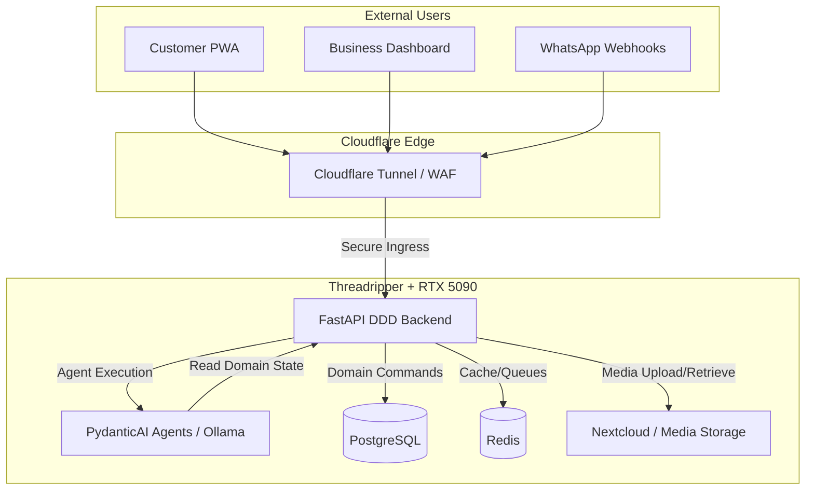

# Architecture System Overview

> [!info] C4 Level 1 & 2 Context
> NOVA operates on a **Local-First Server** architecture exposed securely to the internet. The core application is a FastAPI monolith structured via Domain-Driven Design (DDD), augmented by local PydanticAI agents.

## System Components

1. **Customer/Business PWA (SvelteKit):** The frontend interface.
2. **Cloudflare Tunnel:** The secure ingress layer. No public ports are exposed on the local server.
3. **FastAPI Backend (DDD):** The core application server handling API, Webhooks, and Domain orchestration.
4. **PydanticAI Engine:** Local AI agents running on the RTX 5090, triggered by the backend.
5. **Nextcloud:** Dedicated media storage for business owners (logos, portfolios, facility images).
6. **PostgreSQL & Redis:** State and caching databases running locally on the NVMe Gen5 storage.

## Data Flow & Architecture Diagram

## Key Architectural Decisions

- **No Port Forwarding:** We use Cloudflare Tunnels (`cloudflared`) to route traffic to the local FastAPI server. This hides the home/office IP and provides enterprise-grade DDoS protection.
- **Decoupled Media:** Business owners upload heavy media (salon portfolios, clinic images) directly to **Nextcloud**. The FastAPI backend only stores the Nextcloud WebDAV URLs or share links in PostgreSQL, keeping the core DB lightweight and fast.
- **Local AI Sovereignty:** Sensitive customer data (health, beauty preferences) is processed locally on the RTX 5090, ensuring strict compliance with GCC data residency laws.
