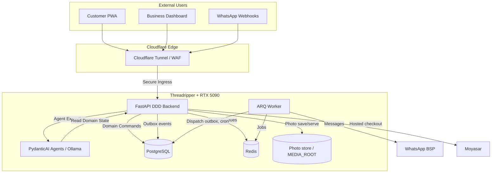

# Architecture System Overview

> [!info] C4 Level 1 & 2 Context
> NOVA operates on a **Local-First Server** architecture exposed securely to the internet. The core application is a FastAPI monolith structured via Domain-Driven Design (DDD), augmented by local PydanticAI agents.

## System Components

1. **SvelteKit frontend (`nova-frontend/`):** the public marketplace (`/discover`, storefronts,
   bookings) and the staff dashboard (`/app`), in English and Arabic. Server-rendered by
   `adapter-node`; it talks to the API over `/api/v1` from the browser.
2. **Cloudflare Tunnel:** The secure ingress layer. No public ports are exposed on the local server.
3. **FastAPI Backend (DDD):** The core application server handling API, Webhooks, and Domain orchestration.
4. **PydanticAI Engine:** Local AI agents running on the RTX 5090, triggered by the backend.
5. **Photo store (`MEDIA_ROOT`):** business covers and galleries, re-encoded to WebP by the API
   and kept on a local volume behind the `ImageStore` interface (ADR-0013).
6. **PostgreSQL & Redis:** State and caching databases running locally on the NVMe Gen5 storage.

## Data Flow & Architecture Diagram

```mermaid
graph TD
    subgraph External Users
        C[Customer PWA]
        B[Business Dashboard]
        W[WhatsApp Webhooks]
    end

    subgraph Cloudflare Edge
        CF[Cloudflare Tunnel / WAF]
    end

    subgraph Local NOVA Server [Threadripper + RTX 5090]
        API[FastAPI DDD Backend]
        AI[PydanticAI Agents / Ollama]
        PG[(PostgreSQL)]
        RD[(Redis)]
        FS[(Photo store / MEDIA_ROOT)]
        WK[ARQ Worker]
    end

    C --> CF
    B --> CF
    W --> CF

    CF -->|Secure Ingress| API

    API -->|Domain Commands| PG
    API -->|Cache/Queues| RD
    API -->|Photo save/serve| FS
    API -->|Outbox events| PG
    WK -->|Dispatch outbox, cron| PG
    WK -->|Jobs| RD
    WK -->|Messages| WA[WhatsApp BSP]
    API -->|Hosted checkout| MY[Moyasar]
    API -->|Agent Execution| AI

    AI -->|Read Domain State| API

```

## Key Architectural Decisions

- **No Port Forwarding:** We use Cloudflare Tunnels (`cloudflared`) to route traffic to the local FastAPI server. This hides the home/office IP and provides enterprise-grade DDoS protection.
- **Photos outside the database:** A business's cover and gallery are uploaded to the API, decoded and re-encoded (which strips EXIF location and refuses non-images), and stored as files. PostgreSQL holds only the `business_photos` index. An S3-compatible adapter can replace the local store without touching callers (ADR-0013).
- **Maps without a vendor:** Leaflet with OpenStreetMap tiles runs in the browser; the backend only stores branch coordinates and answers viewport and GeoJSON queries (ADR-0012).
- **Local AI Sovereignty:** Sensitive customer data (health, beauty preferences) is processed locally on the RTX 5090, ensuring strict compliance with GCC data residency laws.

> [!note] Implemented differences
> Nextcloud was removed on 2026-09-17 (ADR-0013). The worker is a separate process (`worker`
> service) that dispatches the domain-event outbox and runs cron jobs; without it no notification
> is sent and no commission accrues.
