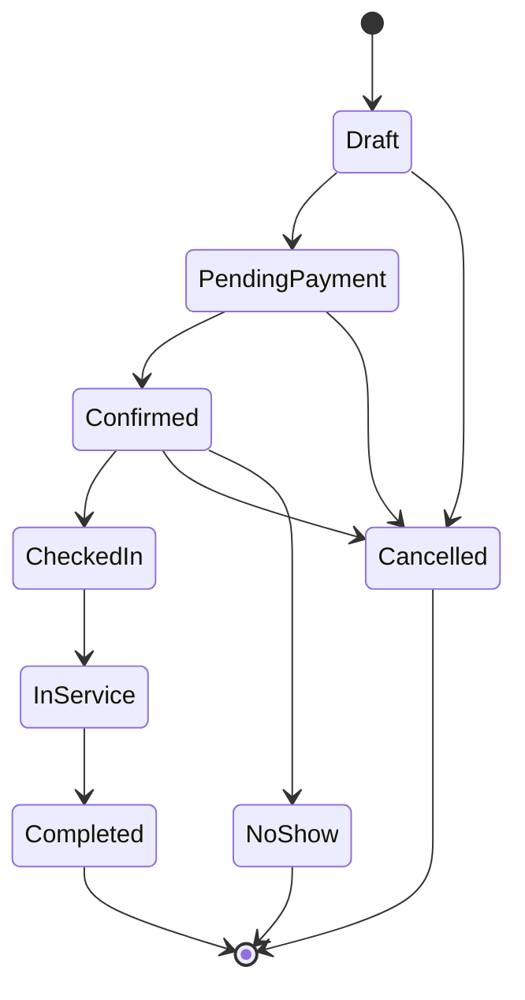
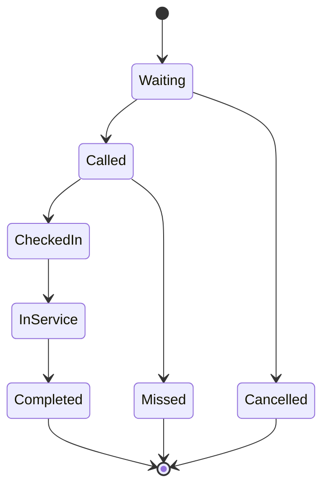

# Domain Models and Aggregates

> [!important] Purpose
> This document defines the core domain models for NOVA Beauty.
>
> These models represent the business truth of the system. FastAPI, SQLAlchemy, PydanticAI, Nextcloud, and Cloudflare are infrastructure concerns and must not dictate the domain model.

---

## 1. Domain Placement

In the pragmatic vertical-sliced DDD structure, domain models live inside each module:

```text
app/modules/
  identity/domain.py
  catalog/domain.py
  booking/domain.py
  queue/domain.py
  payment/domain.py
  media/domain.py
  notification/domain.


```

Domain files may contain:

- Entities
- Value objects
- Enums
- Domain exceptions
- Domain policies
- Aggregate methods
- Domain event names

Domain files must not contain:

- FastAPI imports
- SQLAlchemy imports
- HTTP concerns
- WhatsApp concerns
- Nextcloud concerns
- PydanticAI agent logic


## 2. Core Aggregates

|Aggregate|Responsibility|
|---|---|
|**Business**|Tenant-level business profile and settings|
|**Location**|Physical branch and operating rules|
|**Service**|Bookable beauty/wellness service|
|**Provider**|Staff member or resource performing services|
|**Availability**|Bookable time for a provider/service/location|
|**Customer**|End-customer profile and consent|
|**Booking**|Scheduled appointment|
|**Queue**|Live queue for a location|
|**QueueEntry**|A customer's position in a queue|
|**Ticket**|Secure virtual QR ticket|
|**Payment**|Payment intent, capture, refund, webhook state|
|**MediaAsset**|Nextcloud-backed media metadata|
|**Notification**|Customer communication state|


## 3. Shared Value Objects


```python
from decimal import Decimal
from datetime import datetime
from uuid import UUID
from pydantic import BaseModel, Field, model_validator


class Money(BaseModel):
    amount: Decimal = Field(ge=0, decimal_places=2)
    currency: str = Field(default="SAR", min_length=3, max_length=3)


class TimeRange(BaseModel):
    starts_at: datetime
    ends_at: datetime

    @model_validator(mode="after")
    def validate_range(self):
        if self.ends_at <= self.starts_at:
            raise ValueError("ends_at must be after starts_at")
        return self
        
```


## 4. Booking Aggregate

- ### Booking Status Lifecycle




### Booking Domain Model

``` python
from enum import StrEnum
from uuid import UUID
from datetime import datetime


class BookingStatus(StrEnum):
    DRAFT = "draft"
    PENDING_PAYMENT = "pending_payment"
    CONFIRMED = "confirmed"
    CHECKED_IN = "checked_in"
    IN_SERVICE = "in_service"
    COMPLETED = "completed"
    CANCELLED = "cancelled"
    NO_SHOW = "no_show"


class BookingSource(StrEnum):
    MARKETPLACE = "marketplace"       # NOVA discovery, search, or listing
    DIRECT_LINK = "direct_link"       # the business's own booking page
    WHATSAPP = "whatsapp"             # the business's WhatsApp number
    WALK_IN = "walk_in"               # queue ticket at the counter
    RECEPTION = "reception"           # staff booked on behalf of the customer
    AI_AGENT = "ai_agent"             # inherits the channel it was reached on


class Booking:
    def __init__(
        self,
        id: UUID,
        tenant_id: UUID,
        business_id: UUID,
        location_id: UUID,
        service_id: UUID,
        provider_id: UUID,
        customer_id: UUID,
        starts_at: datetime,
        ends_at: datetime,
        status: BookingStatus,
        source: BookingSource,
    ):
        self.id = id
        self.tenant_id = tenant_id
        self.business_id = business_id
        self.location_id = location_id
        self.service_id = service_id
        self.provider_id = provider_id
        self.customer_id = customer_id
        self.starts_at = starts_at
        self.ends_at = ends_at
        self.status = status
        self.source = source

    def confirm(self):
        if self.status not in (BookingStatus.DRAFT, BookingStatus.PENDING_PAYMENT):
            raise ValueError("Only draft or pending-payment bookings can be confirmed")
        self.status = BookingStatus.CONFIRMED

    def cancel(self):
        if self.status not in (
            BookingStatus.DRAFT,
            BookingStatus.PENDING_PAYMENT,
            BookingStatus.CONFIRMED,
        ):
            raise ValueError("Booking cannot be cancelled in its current state")
        self.status = BookingStatus.CANCELLED

    def mark_no_show(self):
        if self.status != BookingStatus.CONFIRMED:
            raise ValueError("Only confirmed bookings can be marked as no-show")
        self.status = BookingStatus.NO_SHOW

    def check_in(self):
        if self.status != BookingStatus.CONFIRMED:
            raise ValueError("Only confirmed bookings can be checked in")
        self.status = BookingStatus.CHECKED_IN

    def start_service(self):
        if self.status != BookingStatus.CHECKED_IN:
            raise ValueError("Only checked-in bookings can start service")
        self.status = BookingStatus.IN_SERVICE

    def complete(self):
        if self.status != BookingStatus.IN_SERVICE:
            raise ValueError("Only in-service bookings can be completed")
        self.status = BookingStatus.COMPLETED
```


## 5. Queue Aggregate

### Queue Entry Lifecycle




### Queue Domain Model

``` python
class QueueEntryStatus(StrEnum):
    WAITING = "waiting"
    CALLED = "called"
    CHECKED_IN = "checked_in"
    MISSED = "missed"
    IN_SERVICE = "in_service"
    COMPLETED = "completed"
    CANCELLED = "cancelled"


class QueueEntry:
    def __init__(
        self,
        id: UUID,
        tenant_id: UUID,
        queue_id: UUID,
        customer_id: UUID,
        service_id: UUID,
        provider_id: UUID | None,
        status: QueueEntryStatus,
        position: int,
    ):
        self.id = id
        self.tenant_id = tenant_id
        self.queue_id = queue_id
        self.customer_id = customer_id
        self.service_id = service_id
        self.provider_id = provider_id
        self.status = status
        self.position = position

    def call(self):
        if self.status != QueueEntryStatus.WAITING:
            raise ValueError("Only waiting queue entries can be called")
        self.status = QueueEntryStatus.CALLED

    def miss(self):
        if self.status != QueueEntryStatus.CALLED:
            raise ValueError("Only called queue entries can be missed")
        self.status = QueueEntryStatus.MISSED

    def check_in(self):
        if self.status != QueueEntryStatus.CALLED:
            raise ValueError("Only called queue entries can be checked in")
        self.status = QueueEntryStatus.CHECKED_IN

    def cancel(self):
        if self.status != QueueEntryStatus.WAITING:
            raise ValueError("Only waiting queue entries can be cancelled")
        self.status = QueueEntryStatus.CANCELLED
```


## 6. Ticket Aggregate

Tickets are secure virtual tokens. They must never expose PII directly.

``` python
class TicketStatus(StrEnum):
    ACTIVE = "active"
    REDEEMED = "redeemed"
    EXPIRED = "expired"
    REVOKED = "revoked"


class Ticket:
    def __init__(
        self,
        id: UUID,
        tenant_id: UUID,
        ticket_code: str,
        qr_token: str,
        status: TicketStatus,
        expires_at: datetime,
    ):
        self.id = id
        self.tenant_id = tenant_id
        self.ticket_code = ticket_code
        self.qr_token = qr_token
        self.status = status
        self.expires_at = expires_at

    def redeem(self):
        if self.status != TicketStatus.ACTIVE:
            raise ValueError("Only active tickets can be redeemed")
        self.status = TicketStatus.REDEEMED

    def revoke(self):
        if self.status == TicketStatus.REDEEMED:
            raise ValueError("Redeemed tickets cannot be revoked")
        self.status = TicketStatus.REVOKED
```


## 7. Payment Aggregate

- Payment state is separate from booking state.


``` python
class PaymentStatus(StrEnum):
    PENDING = "pending"
    AUTHORIZED = "authorized"
    CAPTURED = "captured"
    FAILED = "failed"
    REFUNDED = "refunded"
    PARTIALLY_REFUNDED = "partially_refunded"


class Payment:
    def __init__(
        self,
        id: UUID,
        tenant_id: UUID,
        booking_id: UUID | None,
        amount: Money,
        status: PaymentStatus,
        gateway: str,
        gateway_payment_id: str | None,
    ):
        self.id = id
        self.tenant_id = tenant_id
        self.booking_id = booking_id
        self.amount = amount
        self.status = status
        self.gateway = gateway
        self.gateway_payment_id = gateway_payment_id

    def mark_captured(self):
        if self.status not in (PaymentStatus.PENDING, PaymentStatus.AUTHORIZED):
            raise ValueError("Only pending or authorized payments can be captured")
        self.status = PaymentStatus.CAPTURED

    def mark_failed(self):
        if self.status == PaymentStatus.CAPTURED:
            raise ValueError("Captured payments cannot be marked failed")
        self.status = PaymentStatus.FAILED
```


## 8. Domain Rules

### Global Rules

- Every tenant-owned aggregate must include `tenant_id`.
- All write operations must enforce tenant isolation.
- AI agents must not mutate aggregates directly.
- External systems must not bypass application services.
- Time-sensitive rules must use timezone-aware datetimes.
- Money calculations must use `Decimal`, never float.

### Beauty-Specific Rules

- A booking must belong to a business, location, service, provider, and customer.
- A service must have duration and price.
- A provider may only perform services assigned to their skill/profile.
- A location may have multiple providers.
- A business may have multiple locations.
- Walk-ins and appointments may share the same provider timeline.
- Queue ordering must be deterministic.
- Ticket QR payloads must contain only secure identifiers and signatures.
- Media files must be stored in Nextcloud, not in PostgreSQL.


## 9. Domain Exceptions

- Use explicit domain exceptions.


``` python


class DomainError(Exception):
    pass


class SlotUnavailableError(DomainError):
    pass


class BookingAlreadyCancelledError(DomainError):
    pass


class TicketInvalidError(DomainError):
    pass


class PaymentNotCapturedError(DomainError):
    pass


class QueueClosedError(DomainError):
    pass
```


- API routers should translate these exceptions into HTTP responses in a central exception handler.


