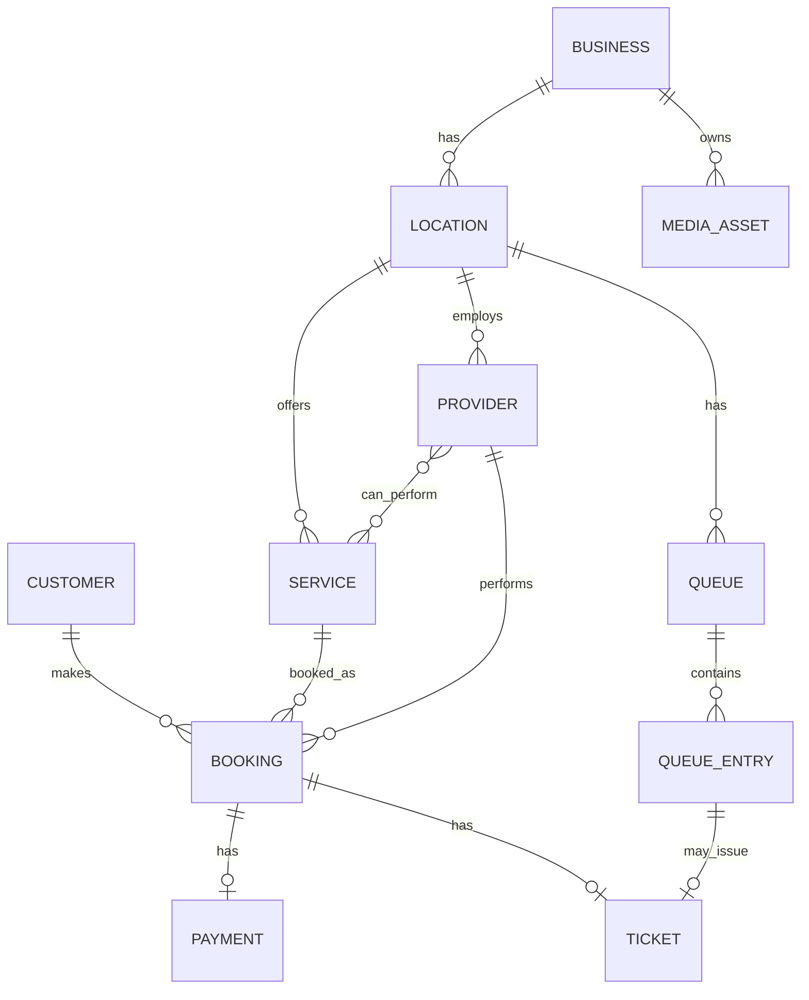

# Database Models and Persistence

> [!important] Purpose
> This document defines the PostgreSQL persistence layer for NOVA Beauty.
>
> SQLAlchemy models are infrastructure models. They are not the domain model and not the API schema. The domain remains the source of business truth.

---


---

## 1. Persistence Rules

- PostgreSQL is the system of record.
- Redis is used for cache, queues, locks, idempotency keys, and temporary slot holds.
- Nextcloud stores binary media files.
- PostgreSQL stores media metadata only.
- Every tenant-owned table must include `tenant_id`.
- Every table should include `created_at` and `updated_at`.
- Soft delete should be preferred for business-critical records.
- Use UUID primary keys.
- Use Alembic for migrations.
- Use explicit indexes for tenant-scoped queries.
- Use the outbox pattern for domain events.
- Webhook events must be stored for audit and idempotency.
- Do not store raw QR secrets in plain text unless encrypted or hashed.

---

## 2. Base Model Mixins

```python
from datetime import datetime
import uuid
from decimal import Decimal

from sqlalchemy import DateTime, func, Boolean
from sqlalchemy.orm import DeclarativeBase, Mapped, mapped_column
from sqlalchemy import Uuid


class Base(DeclarativeBase):
    pass


class TimestampMixin:
    created_at: Mapped[datetime] = mapped_column(
        DateTime(timezone=True),
        server_default=func.now(),
        nullable=False,
    )
    updated_at: Mapped[datetime] = mapped_column(
        DateTime(timezone=True),
        server_default=func.now(),
        onupdate=func.now(),
        nullable=False,
    )


class SoftDeleteMixin:
    deleted_at: Mapped[datetime | None] = mapped_column(
        DateTime(timezone=True),
        nullable=True,
    )
    is_deleted: Mapped[bool] = mapped_column(
        Boolean,
        default=False,
        nullable=False,
    )
```

---

## 3. ERD Overview




4.x Updated ERD + Ai Agents

``` mermaid

```
---

> [!warning] Bilingual columns — this section is out of date
> The models below show a single `name` column. The implemented schema uses **`name_en` /
> `name_ar`** column pairs (and `description_en` / `description_ar`, `title_en` / `title_ar`),
> per `docs/decisions/0004-bilingual-field-strategy.md`. A GCC storefront cannot render a
> single-language service name.
>
> Also note the implemented tables are named `businesses`, `locations`, `services`, `providers`,
> `provider_services`, `bookings` — see `nova_backend/app/modules/*/models.py` for the
> authoritative shape.

## 4. Business Model

```python
from sqlalchemy import String, Text, Boolean, ForeignKey, Index


class Business(TimestampMixin, SoftDeleteMixin, Base):
    __tablename__ = "businesses"

    id: Mapped[uuid.UUID] = mapped_column(Uuid, primary_key=True, default=uuid.uuid4)
    tenant_id: Mapped[uuid.UUID] = mapped_column(Uuid, nullable=False, index=True)
    slug: Mapped[str] = mapped_column(String(255), unique=True, nullable=False)
    name: Mapped[str] = mapped_column(String(255), nullable=False)
    description: Mapped[str | None] = mapped_column(Text)
    logo_asset_id: Mapped[uuid.UUID | None] = mapped_column(Uuid, nullable=True)
    cover_asset_id: Mapped[uuid.UUID | None] = mapped_column(Uuid, nullable=True)
    is_active: Mapped[bool] = mapped_column(Boolean, default=True, nullable=False)
```

Rules:

- `tenant_id` must be enforced on every query.
- `slug` is public and used for business discovery URLs.
- Logo and cover assets reference `media_assets`.

---

## 5. Location Model

```python
from sqlalchemy import Float


class Location(TimestampMixin, SoftDeleteMixin, Base):
    __tablename__ = "locations"

    id: Mapped[uuid.UUID] = mapped_column(Uuid, primary_key=True, default=uuid.uuid4)
    tenant_id: Mapped[uuid.UUID] = mapped_column(Uuid, nullable=False, index=True)
    business_id: Mapped[uuid.UUID] = mapped_column(ForeignKey("businesses.id"), nullable=False)
    latitude: Mapped[float | None] = mapped_column(Float)
    longitude: Mapped[float | None] = mapped_column(Float)
    timezone: Mapped[str] = mapped_column(String(100), default="Asia/Riyadh", nullable=False)
    is_active: Mapped[bool] = mapped_column(Boolean, default=True, nullable=False)

    __table_args__ = (
        Index("ix_locations_tenant_business", "tenant_id", "business_id"),
    )
```

Rules:

- Coordinates are used by Leaflet/OpenStreetMap.
- Timezone is required for correct booking and queue scheduling.
- Each branch belongs to one business.

---

## 6. Service Model

```python
from sqlalchemy import Numeric, Integer


class Service(TimestampMixin, SoftDeleteMixin, Base):
    __tablename__ = "services"

    id: Mapped[uuid.UUID] = mapped_column(Uuid, primary_key=True, default=uuid.uuid4)
    tenant_id: Mapped[uuid.UUID] = mapped_column(Uuid, nullable=False, index=True)
    location_id: Mapped[uuid.UUID] = mapped_column(ForeignKey("locations.id"), nullable=False)
    name: Mapped[str] = mapped_column(String(255), nullable=False)
    description: Mapped[str | None] = mapped_column(Text)
    category: Mapped[str | None] = mapped_column(String(120))
    duration_minutes: Mapped[int] = mapped_column(Integer, nullable=False)
    price: Mapped[Decimal] = mapped_column(Numeric(10, 2), nullable=False)
    currency: Mapped[str] = mapped_column(String(3), default="SAR", nullable=False)
    is_active: Mapped[bool] = mapped_column(Boolean, default=True, nullable=False)

    __table_args__ = (
        Index("ix_services_tenant_location", "tenant_id", "location_id"),
        Index("ix_services_tenant_category", "tenant_id", "category"),
    )
```

Rules:

- Price must use `Decimal`, never float.
- Duration is required for availability calculation.
- A service may belong to a category, such as hair, skin, massage, nails, or wellness.

---

## 7. Provider Model

```python
class Provider(TimestampMixin, SoftDeleteMixin, Base):
    __tablename__ = "providers"

    id: Mapped[uuid.UUID] = mapped_column(Uuid, primary_key=True, default=uuid.uuid4)
    tenant_id: Mapped[uuid.UUID] = mapped_column(Uuid, nullable=False, index=True)
    location_id: Mapped[uuid.UUID] = mapped_column(ForeignKey("locations.id"), nullable=False)
    name: Mapped[str] = mapped_column(String(255), nullable=False)
    title: Mapped[str | None] = mapped_column(String(255))
    image_asset_id: Mapped[uuid.UUID | None] = mapped_column(Uuid, nullable=True)
    is_active: Mapped[bool] = mapped_column(Boolean, default=True, nullable=False)

    __table_args__ = (
        Index("ix_providers_tenant_location", "tenant_id", "location_id"),
    )
```

---

## 8. Provider-Service Assignment Model

```python
class ProviderService(Base):
    __tablename__ = "provider_services"

    provider_id: Mapped[uuid.UUID] = mapped_column(
        ForeignKey("providers.id"),
        primary_key=True,
    )
    service_id: Mapped[uuid.UUID] = mapped_column(
        ForeignKey("services.id"),
        primary_key=True,
    )
    tenant_id: Mapped[uuid.UUID] = mapped_column(Uuid, nullable=False, index=True)
```

Rules:

- A provider can only be assigned to services they are qualified to perform.
- Tenant isolation must be enforced.
- This table supports AI booking tools when selecting valid providers.

---

## 9. Customer Model

```python
class Customer(TimestampMixin, SoftDeleteMixin, Base):
    __tablename__ = "customers"

    id: Mapped[uuid.UUID] = mapped_column(Uuid, primary_key=True, default=uuid.uuid4)
    tenant_id: Mapped[uuid.UUID] = mapped_column(Uuid, nullable=False, index=True)
    full_name: Mapped[str] = mapped_column(String(255), nullable=False)
    phone: Mapped[str] = mapped_column(String(32), nullable=False)
    email: Mapped[str | None] = mapped_column(String(255))
    preferred_language: Mapped[str] = mapped_column(String(8), default="ar", nullable=False)
    marketing_consent: Mapped[bool] = mapped_column(Boolean, default=False, nullable=False)
    whatsapp_consent: Mapped[bool] = mapped_column(Boolean, default=False, nullable=False)
    notes: Mapped[str | None] = mapped_column(Text)

    __table_args__ = (
        Index("ix_customers_tenant_phone", "tenant_id", "phone", unique=True),
    )
```

> [!note] Implemented in the `identity` module
> `docs/06` lists `Customer` as an aggregate without placing it in a context. It lives in
> `app/modules/identity/`, which already owns the User/customer distinction — see ADR-0007. The
> implemented table adds a nullable `user_id` linking a self-service customer to their sign-in
> account, and the phone uniqueness index is partial on `is_deleted` so retiring a record frees
> the number.

Rules:

- Customer identity is tenant-scoped.
- Phone is unique per tenant.
- Consent fields are required for WhatsApp and marketing communication.
- Avoid storing unnecessary sensitive data.

---

## 10. Booking Model

```python
class Booking(TimestampMixin, SoftDeleteMixin, Base):
    __tablename__ = "bookings"

    id: Mapped[uuid.UUID] = mapped_column(Uuid, primary_key=True, default=uuid.uuid4)
    tenant_id: Mapped[uuid.UUID] = mapped_column(Uuid, nullable=False, index=True)
    business_id: Mapped[uuid.UUID] = mapped_column(ForeignKey("businesses.id"), nullable=False)
    location_id: Mapped[uuid.UUID] = mapped_column(ForeignKey("locations.id"), nullable=False)
    service_id: Mapped[uuid.UUID] = mapped_column(ForeignKey("services.id"), nullable=False)
    provider_id: Mapped[uuid.UUID] = mapped_column(ForeignKey("providers.id"), nullable=False)
    customer_id: Mapped[uuid.UUID] = mapped_column(ForeignKey("customers.id"), nullable=False)
    starts_at: Mapped[datetime] = mapped_column(DateTime(timezone=True), nullable=False)
    ends_at: Mapped[datetime] = mapped_column(DateTime(timezone=True), nullable=False)
    status: Mapped[str] = mapped_column(String(50), default="draft", nullable=False)
    source: Mapped[str] = mapped_column(String(50), default="pwa", nullable=False)
    notes: Mapped[str | None] = mapped_column(Text)

    __table_args__ = (
        Index("ix_bookings_tenant_location_time", "tenant_id", "location_id", "starts_at"),
        Index("ix_bookings_tenant_provider_time", "tenant_id", "provider_id", "starts_at"),
        Index("ix_bookings_tenant_customer", "tenant_id", "customer_id"),
        Index("ix_bookings_tenant_status", "tenant_id", "status"),
    )
```

> [!note] Implemented differences
> `bookings` carries `notes` (added later) but does **not** use `SoftDeleteMixin` — a booking's
> terminal statuses (`cancelled`, `no_show`, `completed`) already retire it without hiding the
> row, and soft-deleting one would remove it from the audit trail a dispute needs. Revisit if a
> "delete this booking" requirement ever appears.

Booking statuses:

```text
draft
pending_payment
confirmed
checked_in
in_service
completed
cancelled
no_show
```

Rules:

- Booking state transitions must be controlled by the domain layer.
- `source` can be `marketplace`, `direct_link`, `whatsapp`, `walk_in`, `reception`, or
  `ai_agent` — the attribution vocabulary from `docs/11` §4, not the interface labels this
  document previously listed. It is written once at creation and never updated, because
  commission is computed from it. See ADR-0008.
- AI-created bookings must still pass full domain validation.

---

## 11. Queue Model

```python
class Queue(TimestampMixin, SoftDeleteMixin, Base):
    __tablename__ = "queues"

    id: Mapped[uuid.UUID] = mapped_column(Uuid, primary_key=True, default=uuid.uuid4)
    tenant_id: Mapped[uuid.UUID] = mapped_column(Uuid, nullable=False, index=True)
    location_id: Mapped[uuid.UUID] = mapped_column(ForeignKey("locations.id"), nullable=False)
    name: Mapped[str] = mapped_column(String(255), default="Main Queue", nullable=False)
    is_open: Mapped[bool] = mapped_column(Boolean, default=True, nullable=False)

    __table_args__ = (
        Index("ix_queues_tenant_location", "tenant_id", "location_id"),
    )
```

---

## 12. Queue Entry Model

```python
class QueueEntry(TimestampMixin, SoftDeleteMixin, Base):
    __tablename__ = "queue_entries"

    id: Mapped[uuid.UUID] = mapped_column(Uuid, primary_key=True, default=uuid.uuid4)
    tenant_id: Mapped[uuid.UUID] = mapped_column(Uuid, nullable=False, index=True)
    queue_id: Mapped[uuid.UUID] = mapped_column(ForeignKey("queues.id"), nullable=False)
    customer_id: Mapped[uuid.UUID] = mapped_column(ForeignKey("customers.id"), nullable=False)
    service_id: Mapped[uuid.UUID] = mapped_column(ForeignKey("services.id"), nullable=False)
    provider_id: Mapped[uuid.UUID | None] = mapped_column(ForeignKey("providers.id"))
    status: Mapped[str] = mapped_column(String(50), default="waiting", nullable=False)
    position: Mapped[int] = mapped_column(Integer, nullable=False)
    party_size: Mapped[int] = mapped_column(Integer, default=1, nullable=False)
    called_at: Mapped[datetime | None] = mapped_column(DateTime(timezone=True))
    checked_in_at: Mapped[datetime | None] = mapped_column(DateTime(timezone=True))
    completed_at: Mapped[datetime | None] = mapped_column(DateTime(timezone=True))

    __table_args__ = (
        Index(
            "ix_queue_entries_tenant_queue_status_position",
            "tenant_id",
            "queue_id",
            "status",
            "position",
        ),
        Index("ix_queue_entries_tenant_customer", "tenant_id", "customer_id"),
    )
```

Queue entry statuses:

```text
waiting
called
checked_in
missed
in_service
completed
cancelled
```

Rules:

- Queue ordering must be deterministic.
- Position updates must be transactional.
- AI agents may read queue state but must not directly reorder entries.

---

## 13. Ticket Model

```python
class Ticket(TimestampMixin, Base):
    __tablename__ = "tickets"

    id: Mapped[uuid.UUID] = mapped_column(Uuid, primary_key=True, default=uuid.uuid4)
    tenant_id: Mapped[uuid.UUID] = mapped_column(Uuid, nullable=False, index=True)
    booking_id: Mapped[uuid.UUID | None] = mapped_column(ForeignKey("bookings.id"))
    queue_entry_id: Mapped[uuid.UUID | None] = mapped_column(ForeignKey("queue_entries.id"))
    ticket_code: Mapped[str] = mapped_column(String(100), unique=True, nullable=False)
    qr_token_hash: Mapped[str] = mapped_column(String(255), nullable=False)
    status: Mapped[str] = mapped_column(String(50), default="active", nullable=False)
    expires_at: Mapped[datetime] = mapped_column(DateTime(timezone=True), nullable=False)
    redeemed_at: Mapped[datetime | None] = mapped_column(DateTime(timezone=True))
    revoked_at: Mapped[datetime | None] = mapped_column(DateTime(timezone=True))

    __table_args__ = (
        Index("ix_tickets_tenant_status", "tenant_id", "status"),
        Index("ix_tickets_tenant_booking", "tenant_id", "booking_id"),
        Index("ix_tickets_tenant_queue_entry", "tenant_id", "queue_entry_id"),
    )
```

Ticket statuses:

```text
active
redeemed
expired
revoked
```

Rules:

- Store a hash of the QR token where possible.
- The QR payload must not contain customer PII.
- Ticket redemption must be idempotent.
- Expired tickets must not be redeemable.

---

## 14. Payment Model

```python
class Payment(TimestampMixin, Base):
    __tablename__ = "payments"

    id: Mapped[uuid.UUID] = mapped_column(Uuid, primary_key=True, default=uuid.uuid4)
    tenant_id: Mapped[uuid.UUID] = mapped_column(Uuid, nullable=False, index=True)
    booking_id: Mapped[uuid.UUID | None] = mapped_column(ForeignKey("bookings.id"))
    amount: Mapped[Decimal] = mapped_column(Numeric(10, 2), nullable=False)
    currency: Mapped[str] = mapped_column(String(3), default="SAR", nullable=False)
    status: Mapped[str] = mapped_column(String(50), default="pending", nullable=False)
    gateway: Mapped[str] = mapped_column(String(50), default="moyasar", nullable=False)
    gateway_payment_id: Mapped[str | None] = mapped_column(String(255))
    webhook_verified: Mapped[bool] = mapped_column(Boolean, default=False, nullable=False)
    failure_code: Mapped[str | None] = mapped_column(String(255))
    captured_at: Mapped[datetime | None] = mapped_column(DateTime(timezone=True))
    refunded_at: Mapped[datetime | None] = mapped_column(DateTime(timezone=True))

    __table_args__ = (
        Index("ix_payments_tenant_booking", "tenant_id", "booking_id"),
        Index("ix_payments_tenant_status", "tenant_id", "status"),
        Index("ix_payments_gateway_payment_id", "gateway_payment_id"),
    )
```

Payment statuses:

```text
pending
authorized
captured
failed
refunded
partially_refunded
```

Rules:

- Payment state is separate from booking state.
- Webhook payloads must be verified before changing payment state.
- Payment capture must be idempotent.
- Moyasar capabilities must be verified against current documentation.

---

## 15. Media Asset Model

```python
from sqlalchemy import Integer, BigInteger


class MediaAsset(TimestampMixin, SoftDeleteMixin, Base):
    __tablename__ = "media_assets"

    id: Mapped[uuid.UUID] = mapped_column(Uuid, primary_key=True, default=uuid.uuid4)
    tenant_id: Mapped[uuid.UUID] = mapped_column(Uuid, nullable=False, index=True)
    business_id: Mapped[uuid.UUID] = mapped_column(ForeignKey("businesses.id"), nullable=False)
    location_id: Mapped[uuid.UUID | None] = mapped_column(ForeignKey("locations.id"))
    kind: Mapped[str] = mapped_column(String(50), nullable=False)
    file_name: Mapped[str] = mapped_column(String(255), nullable=False)
    content_type: Mapped[str] = mapped_column(String(255), nullable=False)
    size_bytes: Mapped[int] = mapped_column(BigInteger, nullable=False)
    webdav_path: Mapped[str] = mapped_column(String(1000), nullable=False)
    thumbnail_path: Mapped[str | None] = mapped_column(String(1000))
    is_public: Mapped[bool] = mapped_column(Boolean, default=False, nullable=False)
    is_ready: Mapped[bool] = mapped_column(Boolean, default=False, nullable=False)

    __table_args__ = (
        Index("ix_media_assets_tenant_business", "tenant_id", "business_id"),
        Index("ix_media_assets_tenant_kind", "tenant_id", "kind"),
    )
```

Media kinds:

```text
logo
cover
service_image
provider_image
location_image
portfolio
```

Nextcloud path convention:

```text
/nova-media/{tenant_id}/{business_id}/{kind}/{asset_id}/{file_name}
```

Rules:

- Binary files live in Nextcloud.
- PostgreSQL stores metadata only.
- Media deletion should be soft-delete first, then background hard delete.
- Tenant isolation must be enforced on all media queries.

---

## 16. Domain Event Outbox Model

> [!warning] This section describes an earlier design
> The implemented table is **`domain_events`**, not `domain_event_outbox`, and its columns are
> `event_name`, `available_at`, `published_at`, `attempts`, and `last_error` — see
> `nova_backend/app/db/outbox.py`. The differences are deliberate: `available_at` plus
> `attempts` gives exponential backoff and dead-lettering, which a bare `published` boolean and
> `retry_count` cannot express. `aggregate_id` and `correlation_id` are genuinely absent and are
> worth adding for tracing. The dispatcher is `app/worker/outbox.py`.

```python
from sqlalchemy.dialects.postgresql import JSONB


class DomainEventOutbox(TimestampMixin, Base):
    __tablename__ = "domain_event_outbox"

    id: Mapped[uuid.UUID] = mapped_column(Uuid, primary_key=True, default=uuid.uuid4)
    tenant_id: Mapped[uuid.UUID] = mapped_column(Uuid, nullable=False, index=True)
    event_type: Mapped[str] = mapped_column(String(255), nullable=False)
    aggregate_id: Mapped[uuid.UUID] = mapped_column(Uuid, nullable=False)
    correlation_id: Mapped[uuid.UUID | None] = mapped_column(Uuid)
    payload: Mapped[dict] = mapped_column(JSONB, nullable=False)
    published: Mapped[bool] = mapped_column(Boolean, default=False, nullable=False)
    published_at: Mapped[datetime | None] = mapped_column(DateTime(timezone=True))
    retry_count: Mapped[int] = mapped_column(Integer, default=0, nullable=False)

    __table_args__ = (
        Index("ix_outbox_unpublished", "published", "created_at"),
        Index("ix_outbox_tenant_event", "tenant_id", "event_type"),
    )
```

Rules:

- Domain events must be written to the outbox in the same database transaction as the aggregate change.
- A worker publishes events to Redis, WhatsApp workers, AI workers, or notification workers.
- Consumers must be idempotent.

---

## 17. Webhook Event Model

```python
class WebhookEvent(TimestampMixin, Base):
    __tablename__ = "webhook_events"

    id: Mapped[uuid.UUID] = mapped_column(Uuid, primary_key=True, default=uuid.uuid4)
    provider: Mapped[str] = mapped_column(String(100), nullable=False)
    external_event_id: Mapped[str] = mapped_column(String(255), nullable=False)
    payload: Mapped[dict] = mapped_column(JSONB, nullable=False)
    received_at: Mapped[datetime] = mapped_column(DateTime(timezone=True), server_default=func.now())
    processed_at: Mapped[datetime | None] = mapped_column(DateTime(timezone=True))
    error: Mapped[str | None] = mapped_column(Text)

    __table_args__ = (
        Index("ix_webhook_provider_external_id", "provider", "external_event_id", unique=True),
    )
```

Rules:

- Use this table for Moyasar, WhatsApp provider, and Nextcloud webhooks.
- The unique constraint prevents duplicate webhook processing.
- Store raw payloads for audit and debugging.

---

## 18. Indexing Strategy

Use indexes for the most common NOVA Beauty queries:

```text
Tenant + business lookup
Tenant + location lookup
Tenant + active services
Tenant + provider availability
Tenant + booking by date
Tenant + queue state
Tenant + ticket status
Tenant + media assets
```

Avoid over-indexing tables with heavy write traffic. Review query plans periodically.

---

## 20. Migration Rules

Use Alembic for all schema changes.

Rules:

- Every migration must be reversible where practical.
- Every migration must include tenant-safe defaults.
- Do not rename columns used by production code without a phased migration.
- Large data migrations must run in batches.
- Always test migrations against a production-like database copy.
- Document risky migrations in an RFC or ADR.

Suggested migration naming:

```text
alembic revision -m "add_booking_no_show_status"
alembic revision -m "add_media_asset_thumbnail_path"
alembic revision -m "create_webhook_events_table"
```

---

## 21. Backup and Recovery Rules

Because NOVA runs on local infrastructure:

- PostgreSQL must be backed up daily.
- Use `pg_dump` for logical backups and/or WAL archiving for point-in-time recovery.
- Store backups on a separate physical disk or offsite storage.
- Test restore procedures monthly.
- Nextcloud data must also be backed up.
- Redis is cache/queue state and may be treated as recreatable, except for critical idempotency keys.
- Cloudflare Tunnel configuration should be version-controlled.

---

## 22. Documentation Maintenance

Update this file whenever:

- A table is added or removed.
- A column changes meaning.
- A new index is added.
- A migration changes tenant isolation behavior.
- A webhook storage rule changes.
- Nextcloud media metadata changes.
- Payment or ticket state changes.

This document must always reflect the actual database schema.