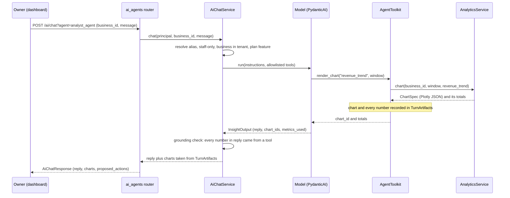
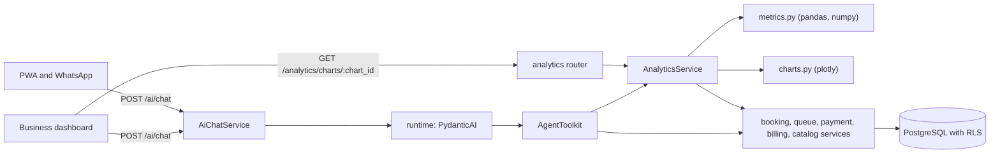

# Business Agents and Analytics

> [!important] Goal
> Give every salon five AI staff members. A receptionist and a customer-service agent face its
> customers. An accountant, an analyst and a business manager face its owner. Every number and
> chart they show comes from NOVA's own data, computed with pandas and numpy and drawn with Plotly,
> never from the model's memory.

> [!info] Status
> Implemented on 2026-09-14. This document was written first, as the plan, and the code follows
> it. The section 12 tests are in `tests/modules/analytics/` and `tests/modules/ai_agents/`;
> `test_turns.py` runs whole turns against a scripted model. The decisions and the alternatives
> rejected are in `docs/decisions/0011-business-agents-and-analytics.md` (ADR-0011).
> [[10-AI-Agent-Catalog]] stays the framework-level catalogue; this document replaces its roster
> (§3) and its insights and billing agents (§8, §10).

## Goals

- One agent, one goal, for the five jobs a salon actually has: get the customer seen, fix the
  customer's problem, know where the money went, understand the numbers, decide what to change.
- Customer-facing agents act only on the caller's own bookings, queue entries and payments.
- Owner-facing agents are read-only. The business manager proposes; staff decide.
- Every figure in a reply traces to a tool result, and every chart is built by the server.
- The analytics behind the agents is also a plain HTTP API, so dashboards work with the inference
  engine offline.

---

## 1. Scope

Three decisions frame everything below. Each was put to the product owner and answered on
2026-09-14.

| Question | Decision |
|---|---|
| Who do the accountant, analyst and business manager serve? | Each salon's own staff: tenant-scoped, staff-only, one business at a time. Analytics across tenants for NOVA's operators is out of scope. |
| How do the new agents relate to the docs/10 roster? | They replace it. The old agent names keep working as aliases. |
| What may the business manager do? | Advise only. It records proposed actions, and staff apply them through the normal endpoints. |

---

## 2. Roster

| Agent | Audience | Goal | Plan feature | Model | Replaces (alias) |
|---|---|---|---|---|---|
| `concierge_agent` | customers | Route a message to the right agent. | every plan | routing | — |
| `receptionist_agent` | customers, reception | Get the customer seen: a held slot or a place in the queue. | `ai_booking_agent`, every plan | reasoning | `booking_agent`, `queue_agent` |
| `customer_service_agent` | customers | Resolve a problem with the caller's own booking or payment, or hand off. | `ai_support_agent`, every plan | reasoning | `support_agent` |
| `accountant_agent` | staff | Explain what the business earned, collected, was paid out and was charged. | every plan | reasoning | `billing_agent` |
| `analyst_agent` | staff | Answer a question about the business's numbers with metrics and charts. | `ai_insights_agent`, Studio and Chain | reasoning | `insights_agent` |
| `business_manager_agent` | staff | Turn the numbers into at most five proposed actions. | `ai_insights_agent`, Studio and Chain | reasoning | — |

`retention_agent` stays unavailable. It sends campaigns, and NOVA has no approved-campaign sender
yet (docs/10 §7).

Rules:

- **An alias resolves before any check.** `?agent=billing_agent` behaves exactly like
  `?agent=accountant_agent`, including the staff-only rule, and the response names the resolved
  agent.
- **The receptionist merges the docs/10 booking and queue agents on purpose.** A walk-in asking
  "can I be seen today?" needs a slot search and the queue together. Splitting them made the
  customer pick an agent before knowing the answer. The goal is still one: get the customer seen.
- **Plan features come from `Plan.included_features`** (docs/11 §2) for the business named in the
  request. Every plan includes `ai_booking_agent` and `ai_support_agent`, so only the two insight
  agents are checked.
- **Concierge routing maps onto the new names.** `BOOKING` and `QUEUE` go to the receptionist,
  `SUPPORT` to customer service, `BILLING` to the accountant, and `INSIGHTS` to the analyst.

---

## 3. Architecture

### 3.1 Placement

```text
app/modules/ai_agents/
  agents.py        # AgentSpec roster: goal, audience, tools, charts, output type, feature, instructions
  tools.py         # AgentToolkit: tool functions over application services
  guardrails.py    # owner-only, grounding check, proposal and chart allowlists (pure)
  service.py       # AgentDeps, TurnArtifacts, AiChatService
  runtime.py       # PydanticAI 2.x + Ollama, fallback matrix
  schemas.py       # AgentOutput family, chat request and response, ProposedActionOut
  router.py        # POST /ai/chat, GET /ai/agents

app/modules/analytics/          # new bounded context; owns no tables
  domain.py        # ReportWindow, Granularity, Dimension, ChartId, MetricName, thresholds (pure)
  metrics.py       # pandas + numpy computations over fact frames (pure)
  charts.py        # Plotly figure builders, bilingual labels (pure)
  service.py       # AnalyticsService: loads facts through other modules' services
  schemas.py       # OverviewOut, KpiOut, BreakdownRowOut, ChartOut, FinancialSummaryOut, ForecastOut
  router.py        # GET /tenants/{tenant_id}/analytics/*
  dependencies.py  # get_analytics_service, build_analytics_service
  exceptions.py    # ReportWindowError, ReportTooLargeError, InsufficientDataError, ...
```

`metrics.py` and `charts.py` are pure like `domain.py`: no FastAPI, no SQLAlchemy, no I/O. They are
tested with synthetic data and no database. numpy, pandas and plotly are imported there and
nowhere else, and an architecture test enforces it.

### 3.2 A turn, end to end





### 3.3 The contract every agent shares

```python
class Audience(StrEnum):
    CUSTOMER = "customer"
    STAFF = "staff"


@dataclass(frozen=True)
class AgentSpec:
    name: str
    goal: str
    audience: Audience
    tools: frozenset[str]
    output_type: type[AgentOutput]
    instructions: str
    charts: frozenset[ChartId] = frozenset()   # charts this agent may render
    required_feature: str | None = None        # a Plan.included_features key
    needs_business: bool = False               # staff agents work on one named business
    prefer_reasoning_model: bool = True
    grounded_numbers: bool = False             # every number in the reply must come from a tool


@dataclass
class TurnArtifacts:
    """What tools produced this turn. The response is built from here, never from model text."""

    charts: dict[str, ChartSpec]
    proposed_actions: dict[str, ProposedAction]
    grounded_values: set[Decimal]
    metrics_used: set[str]
    booking_ids: list[UUID]
    queue_entry_ids: list[UUID]
    handoff_reason: str | None = None


@dataclass
class AgentDeps:
    tenant_id: UUID
    business_id: UUID | None
    principal: Principal
    customer_id: UUID | None
    locale: str
    channel: str
    booking_service: BookingService
    queue_service: QueueService
    catalog_service: CatalogService
    payment_service: PaymentService
    billing_service: BillingService
    analytics_service: AnalyticsService
    artifacts: TurnArtifacts
```

The output types follow the docs/10 §1 `Output` naming:

```python
class AgentOutput(ApiSchema):           # concierge, receptionist, customer service
    reply: str = Field(max_length=4000)
    suggested_actions: list[str] = []
    requires_human_handoff: bool = False
    confidence: float = Field(ge=0.0, le=1.0, default=0.0)


class InsightOutput(AgentOutput):       # accountant, analyst
    chart_ids: list[str] = []           # must name charts a tool rendered this turn
    metrics_used: list[str] = []


class ManagerOutput(InsightOutput):     # business manager
    proposed_action_ids: list[str] = [] # must name actions propose_action recorded this turn
```

The model never returns a figure, an amount or the body of an action. It returns ids, the service
attaches the objects the tools created, and any id no tool produced is dropped and logged.

### 3.4 Chat API

The request is unchanged, except that staff agents now require `business_id`.

```http
POST /api/v1/tenants/{tenant_id}/ai/chat?agent=analyst_agent
Authorization: Bearer <staff access token>

{"session_id": "dash-42", "business_id": "…", "locale": "en",
 "message": "Why was revenue down last month?"}
```

The response adds `agent`, `charts`, `proposed_actions` and `metrics_used`.

```json
{
  "session_id": "dash-42",
  "agent": "analyst_agent",
  "reply": "Completed revenue fell from 48250.00 SAR to 41100.00 SAR ...",
  "suggested_actions": [],
  "requires_human_handoff": false,
  "degraded": false,
  "confidence": 0.8,
  "metrics_used": ["revenue", "no_show_rate"],
  "charts": [{"chart_id": "revenue_trend", "kind": "combo", "figure": {"data": [], "layout": {}}}],
  "proposed_actions": []
}
```

`GET /api/v1/tenants/{tenant_id}/ai/agents` keeps `available` as the list of names. It adds
`aliases` and, for each agent, its `audience`, `goal` and `required_feature`.

---

## 4. The Agents

### 4.1 Receptionist

**Goal:** get the customer seen, with a held appointment slot or a place in the walk-in queue.

- **Trigger:** PWA chat and WhatsApp messages routed by the concierge, or reception staff typing
  for a customer at the desk.

| Tool | Service call | Write? |
|---|---|---|
| `search_services(location_id)` | `CatalogService.list_services` | no |
| `get_provider_info(provider_id)` | `CatalogService.get_provider` | no |
| `get_available_slots(provider_id, service_id, days_ahead)` | `BookingService.availability` | no |
| `hold_slot(provider_id, service_id, starts_at)` | `BookingService.hold_slot` | yes |
| `get_queue_length(queue_id)` | `QueueService.list_queue` | no |
| `join_queue(queue_id, service_id, provider_id, party_size)` | `QueueService.join` | yes |
| `get_queue_position(entry_id)` | `QueueService.assert_entry_visible_to`, then `position_of` | no |

- **Guardrails:**
  - It cannot confirm a booking; a hold is as far as it goes (docs/10 §5). Confirmation stays with
    the verified payment webhook.
  - It holds slots and joins the queue only for the caller: the principal's own customer record,
    or the customer staff named in `customer_id`. That matches
    `POST /queues/{queue_id}/entries`.
  - It reads a queue position only for an entry the caller may see.
  - It quotes prices and times only as the tools return them.

### 4.2 Customer Service

**Goal:** resolve a problem with the caller's own booking or payment, or hand off with the context a
person needs.

| Tool | Service call | Write? |
|---|---|---|
| `list_my_bookings()` | `BookingService.list_for_customer_reference` | no |
| `get_booking_status(booking_id)` | `BookingService.get_for_principal` | no |
| `get_payment_status(booking_id)` | `PaymentService.list_for_booking_for_principal` | no |
| `cancel_booking(booking_id, reason)` | `BookingService.assert_visible_to`, then `cancel` | yes |
| `escalate_to_human(summary)` | records a handoff in `TurnArtifacts` | no |

- **Guardrails:**
  - Every booking and payment read is checked against the principal first. A customer who names
    someone else's booking id gets "not found", exactly as over HTTP. The old `support_agent`
    tools skipped this check; this closes that gap.
  - Cancellation follows the tenant's cancellation policy. The agent cannot waive it, because
    `by_staff` is not a parameter it can reach.
  - It cannot refund, change a payment or promise compensation. A refund request becomes an
    escalation with a summary, and a person decides.
  - A complaint about service quality, or a second failed attempt at the same problem, sets
    `requires_human_handoff`.

### 4.3 Accountant

**Goal:** explain what the business earned, collected, was paid out, and was charged by NOVA,
reconciled to the fils.

- **Audience:** staff only, and `business_id` is required.

| Tool | Service call | Write? |
|---|---|---|
| `get_financial_summary(date_from, date_to)` | `AnalyticsService.financial_summary` | no |
| `get_subscription()` | `BillingService.get_subscription` | no |
| `list_recent_invoices(limit)` | `BillingService.list_invoices` | no |
| `get_invoice(invoice_id)` | `BillingService.get_invoice` | no |
| `explain_commission_line(line_id)` | `BillingService.explain_commission_line` | no |
| `get_plan_comparison()` | `BillingService.plan_comparison` | no |
| `render_chart(chart_id, date_from, date_to, granularity)` | `AnalyticsService.chart` | no |

- **Charts:** `revenue_trend`, `source_mix`, `payouts_breakdown`, `nova_charges`,
  `commission_by_class`.
- **Guardrails:**
  - It is read-only. It cannot change a plan, apply a credit, mark an invoice paid or waive a
    commission (docs/10 §10); those become `suggested_actions`.
  - `grounded_numbers` is on: every amount in the reply must appear in a tool result from this
    turn (§5.2).
  - It explains commission in docs/11 terms: only a customer's first marketplace booking with the
    business is billable, and it is charged net of VAT (ADR-0009).

### 4.4 Analyst

**Goal:** answer a question about the business's own numbers, showing the metric, the period and a
chart.

- **Audience:** staff only, on a plan with `ai_insights_agent`, and `business_id` is required.

| Tool | Service call | Write? |
|---|---|---|
| `get_overview(date_from, date_to)` | `AnalyticsService.overview` | no |
| `get_breakdown(dimension, date_from, date_to)` | `AnalyticsService.breakdown` | no |
| `get_forecast(metric, horizon_weeks)` | `AnalyticsService.forecast` | no |
| `render_chart(chart_id, date_from, date_to, granularity)` | `AnalyticsService.chart` | no |
| `list_charts()` | `AnalyticsService.catalogue` | no |

- **Charts:** every chart in §7 except the three ledger charts (`payouts_breakdown`,
  `nova_charges`, `commission_by_class`).
- **Guardrails:**
  - It is read-only and scoped to one business (docs/10 §8).
  - `grounded_numbers` is on, and every claim names its metric and period, through
    `metrics_used` and the window returned by the tool.
  - When a rate is below its sample threshold (§6.4), it says so instead of reporting noise.
  - A forecast is described as a linear trend with a band, never as a promise.

### 4.5 Business Manager

**Goal:** turn the business's numbers into at most five prioritised proposed actions, each with its
reason and the metric behind it. Advise only.

- **Audience:** staff only, on a plan with `ai_insights_agent`, and `business_id` is required.

| Tool | Service call | Write? |
|---|---|---|
| `get_overview(date_from, date_to)` | `AnalyticsService.overview` | no |
| `get_breakdown(dimension, date_from, date_to)` | `AnalyticsService.breakdown` | no |
| `get_forecast(metric, horizon_weeks)` | `AnalyticsService.forecast` | no |
| `render_chart(chart_id, date_from, date_to, granularity)` | `AnalyticsService.chart` | no |
| `propose_action(kind, title, rationale, metric, target_id)` | records a `ProposedAction` in `TurnArtifacts` | no |

- **Charts:** `bookings_trend`, `revenue_trend`, `booking_outcomes`, `revenue_by_service`,
  `revenue_by_provider`, `revenue_by_location`, `new_vs_returning`, `peak_hours`,
  `provider_utilization`, `bookings_forecast`, `queue_wait_times`.
- **Guardrails:**
  - No tool writes. `propose_action` records a proposal, and nothing in NOVA executes it (§8).
  - Action kinds come from a fixed list, each mapped to the endpoint a person would use. Any other
    kind is refused.
  - A `target_id` must resolve inside the tenant, to a provider, service or location of this
    business.
  - `grounded_numbers` is on, and every proposal cites a metric used in the same turn.

---

## 5. Guardrails

### 5.1 Enforcement

| Guardrail | Enforced where | On failure |
|---|---|---|
| Alias resolution | `agents.resolve_agent` | an unknown or unavailable name is a 403 `agent_guardrail` |
| Staff-only agents | `guardrails.assert_caller_may_use_agent` | 403 `agent_guardrail`, before inference |
| One named business | `AiChatService`, through `CatalogService.get_business` | 422 when missing, 404 when not in the tenant |
| Plan feature | `AiChatService`, through `BillingService.subscription_or_default` | 403 `plan_feature_required` |
| Per-row ownership | each customer-facing tool | the tool tells the model "not found" |
| Tool allowlist | `AgentSpec.tools` | the tool is never registered |
| Chart allowlist | `AgentSpec.charts`, checked in `render_chart` | the tool refuses |
| Numeric grounding | output validator using `guardrails.find_ungrounded_numbers` | one retry naming the numbers, then handoff |
| Artifact ids | `AiChatService`, after the run | unknown chart or action ids are dropped and logged |
| Usage limits | `UsageLimits(request_limit=8, tool_calls_limit=12)` | the turn ends in a handoff |
| PII redaction, injection framing | pre-prompt (docs/10 §11) | unchanged |

### 5.2 Numeric Grounding

A model that is asked about money will sometimes produce money. Grounding makes that visible and
retryable:

1. **Every tool result is scanned** as it returns. Its numbers, including dates, times and window
   lengths, go into `TurnArtifacts.grounded_values`. The scanner reads Western digits, Arabic-Indic
   (٠–٩) and Extended Arabic-Indic (۰–۹) digits, thousands separators (`,` and `٬`), decimal
   separators (`.` and `٫`), and percentages.
2. **The output validator scans the reply.** A number is grounded when it equals a grounded value
   at the reply's own precision, or is that value written as a percentage (0.1833 as "18.3%").
3. **Integers from 0 to 10 not followed by `%` are exempt**, as in "the top 3 services". This is a
   deliberate, documented hole.
4. **An ungrounded number triggers a retry.** PydanticAI's `ModelRetry` names the offending
   numbers and asks for figures from the tools. A second failure hands off with `degraded: true`.

Grounding is a floor, not a proof. A model can still attach a real number to the wrong metric.
`metrics_used` and the chart are how a reader checks.

---

## 6. The Analytics Context

### 6.1 Why a Context of Its Own

Analytics reads across booking, payment, queue, billing and catalog, and owns none of them.
Putting it inside any one of them would give that module four new dependencies. Reading their
tables directly is what `tests/test_architecture.py` forbids. So each owning module exposes narrow
**fact projections** on its service, and `analytics` composes them. This follows the pattern
`BookingRepository.map_business_ids` already uses for the payout job: the columns the caller asked
for, and nothing more.

### 6.2 Facts

| Fact | Owning service method | Fields (no names, phones or emails) |
|---|---|---|
| `BookingFact` | `BookingService.list_booking_facts(business_id, window)` | id, location_id, service_id, provider_id, customer_id, starts_at, ends_at, created_at, status, source, price_minor, currency |
| `CustomerVisitFact` | `BookingService.list_customer_visit_facts(business_id)` | customer_id, first_completed_at, last_completed_at, completed_count, has_upcoming |
| `ProviderCapacityFact` | `BookingService.list_capacity_facts(provider_ids, window)` | provider_id, weekly working windows, dated exceptions |
| `PaymentFact` | `PaymentService.list_payment_facts(window)` | booking_id, status, amount_minor, refunded_minor, currency, captured_at, refunded_at |
| `QueueEntryFact` | `QueueService.list_queue_facts(location_ids, window)` | location_id, service_id, provider_id, source, status, party_size, joined_at, called_at, completed_at |
| Ledger | `BillingService.list_invoices_between`, `list_payouts_between`, `list_commission_lines_between` | the existing `Invoice`, `Payout` and `CommissionLine` entities |
| Labels | `CatalogService.list_locations`, `list_services`, `list_providers` | ids, `name_en`, `name_ar`, timezone |

Facts are frozen dataclasses in each owner's `domain.py`, projected by its repository with only the
listed columns. `customer_id` is an opaque id, needed to count distinct and returning customers. It
never reaches a chart or a reply.

### 6.3 Computation Rules

- **Money** is aggregated in pandas as int64 minor units (fils) and converted back to `Decimal` for
  every KPI (docs/06 §8: never float). Floats appear only inside chart figures, which are
  presentation.
- **Time:** facts are stored in UTC. Series are bucketed in the business's primary location
  timezone, and `peak_hours` uses each branch's own timezone. A local day starts at local midnight
  (ADR-0007).
- **Window:** `date_from` and `date_to` are local dates, both inclusive. The default is the last 30
  days ending today, and the maximum is 400 days. Granularity is chosen automatically unless
  given: day up to 45 days, week up to 180, month beyond.
- **Size:** a fact query that would return more than 50,000 rows fails with 422
  `report_too_large`. It is never silently truncated.
- **Currency:** NOVA is SAR-only. Rows in any other currency are excluded and counted in
  `excluded_rows`, the same treatment ADR-0009 gives a second currency at payout.
- **Caching:** computation happens per request. Facts loaded once are memoised on the service for
  the rest of that request, so an agent's several tool calls hit the database once.

### 6.4 Metric Dictionary

| Metric | Definition | Unit | Reported only when |
|---|---|---|---|
| `bookings` | bookings starting in the window, any status | count | always |
| `completed`, `cancelled`, `no_show` | bookings in that status | count | always |
| `completion_rate` | completed ÷ (completed + cancelled + no_show) | ratio | denominator ≥ 20 |
| `cancellation_rate` | cancelled ÷ the same denominator | ratio | denominator ≥ 20 |
| `no_show_rate` | no_show ÷ the same denominator | ratio | denominator ≥ 20 |
| `revenue` | Σ price of completed bookings | money | always |
| `average_ticket` | revenue ÷ completed, rounded half-up to 0.01 | money | completed ≥ 1 |
| `collected` | Σ (amount − refunded) of settled payments captured in the window, for this business's bookings | money | always |
| `refunded` | Σ refunded amount of payments refunded in the window | money | always |
| `prepaid_share` | completed bookings with a settled payment ÷ completed | ratio | completed ≥ 20 |
| `unique_customers` | distinct customers with a completed booking | count | always |
| `new_customers` | of those, customers whose first-ever completed visit is in the window | count | always |
| `returning_customers` | unique_customers − new_customers | count | always |
| `repeat_rate` | returning_customers ÷ unique_customers | ratio | unique_customers ≥ 20 |
| `lapsed_customers` | last completed visit 60 to 365 days before the window end, nothing upcoming | count | always |
| `utilization` | booked minutes ÷ scheduled minutes. Booked means completed, in service, checked in, confirmed or pending payment | ratio | scheduled minutes > 0 |
| `marketplace_share` | bookings with source `marketplace` ÷ bookings | ratio | bookings ≥ 20 |
| `median_lead_time_hours` | median of (starts_at − created_at) | hours | bookings ≥ 20 |
| `walk_ins` | queue entries joined in the window | count | always |
| `average_queue_wait_minutes` | mean of (called_at − joined_at) | minutes | called entries ≥ 20 |

The accountant's **financial summary** adds the ledger, each amount assigned by the date named:

- **From bookings and payments:** `revenue`, `collected` and `refunded` as above.
- **Commission, by accrual date:** accrued and reversed.
- **Payouts, by payout date:** collected, processing fees, commission netted, and net.
- **NOVA invoices, by period start:** subscription, commission, processing, VAT and total, plus
  the count and total of outstanding invoices (status `issued` or `overdue`).

A suppressed metric is returned with `value: null`, its `sample_size` and `suppressed: true`. A
dashboard can then say "not enough data yet" instead of showing 0%.

---

## 7. Chart Catalog

| Chart id | Question it answers | Plotly form | Encoding | Agents | Plan |
|---|---|---|---|---|---|
| `bookings_trend` | How many bookings per period, and how did they end? | stacked bar | x period, y count, colour outcome | analyst, manager | all |
| `revenue_trend` | What did completed bookings earn per period? | bar + line (second y axis) | bar revenue, line average ticket | analyst, accountant, manager | all |
| `booking_outcomes` | What share completed, cancelled or no-showed? | donut | share by outcome | analyst, manager | all |
| `revenue_by_service` | Which services earn most? | horizontal bar, top 10 | revenue; completed count on hover | analyst, manager | all |
| `revenue_by_provider` | Which providers earn most? | horizontal bar | revenue; completed count on hover | analyst, manager | all |
| `revenue_by_location` | How do branches compare? | bar | revenue per location | analyst, manager | `cross_location_reporting` |
| `source_mix` | Where do bookings come from? | donut | share by `BookingSource` | analyst, accountant | all |
| `new_vs_returning` | Is the business growing, or retaining? | stacked bar | new and returning customers per period | analyst, manager | all |
| `retention_cohorts` | Do first-time customers come back? | heatmap | first-visit month × months since, % active; cohorts under 5 hidden | analyst | all |
| `peak_hours` | When are the busiest hours? | heatmap | weekday × local hour, booking starts | analyst, manager | all |
| `provider_utilization` | Who is over- or under-booked? | bar | utilization per provider; booked and scheduled hours on hover | analyst, manager | all |
| `bookings_forecast` | Where are weekly bookings heading? | line + band | history, linear trend, 95% band | analyst, manager | all |
| `queue_wait_times` | How long do walk-ins wait? | bar + line (second y axis) | walk-ins per day, average wait | analyst, manager | all |
| `payouts_breakdown` | What was paid out, and what was deducted? | stacked bar | net, commission netted, processing fee per payout date | accountant | all |
| `nova_charges` | What did NOVA invoice each month? | stacked bar | subscription, commission, processing, VAT per invoice | accountant | all |
| `commission_by_class` | Why is commission what it is? | bar | commission by class, reversals as negatives | accountant | all |

### 7.1 Chart Contract

```json
{
  "chart_id": "revenue_trend",
  "kind": "combo",
  "title": "Revenue from completed bookings",
  "description": "Completed-booking revenue per week, with the average ticket.",
  "locale": "en",
  "business_id": "…",
  "date_from": "2026-08-01",
  "date_to": "2026-08-31",
  "granularity": "week",
  "currency": "SAR",
  "data_points": 5,
  "generated_at": "2026-09-14T12:00:00Z",
  "figure": {
    "data": [
      {"type": "bar", "name": "Revenue", "x": ["2026-07-27", "…"], "y": [9150.0, "…"]},
      {"type": "scatter", "mode": "lines+markers", "name": "Average ticket", "yaxis": "y2",
       "x": ["2026-07-27", "…"], "y": [152.5, "…"]}
    ],
    "layout": {"yaxis2": {"overlaying": "y", "side": "right"}, "…": "…"}
  }
}
```

- **`figure` is Plotly's own JSON** (`data` plus `layout`), produced with `plotly.io.to_json` so
  numpy values serialise. The client draws it with plotly.js:
  `Plotly.newPlot(element, chart.figure.data, chart.figure.layout, {responsive: true, displaylogo: false})`.
- **Language:** titles, axis labels, legend names and category labels follow `locale` (`en` or
  `ar`). Service, provider and location names come from their `name_en`/`name_ar` pair (ADR-0004).
- **Theme:** paper and plot backgrounds are transparent and the categorical palette is fixed, so
  the dashboard's own theme shows through. Money axes carry the currency code.
- **Privacy:** no customer id, name or phone number appears in any figure; charts carry aggregates
  only.
- **No server-side images** (ADR-0011): a WhatsApp conversation gets the text reply only.

---

## 8. Proposed Actions

| Kind | Meaning | Target | Staff apply it with |
|---|---|---|---|
| `adjust_working_hours` | Change a provider's weekly hours | provider | `PUT /tenants/{tenant_id}/schedules/providers/{provider_id}` |
| `add_schedule_exception` | Close or open a provider on one date | provider | `POST /tenants/{tenant_id}/schedules/providers/{provider_id}/exceptions` |
| `change_queue_hours` | Open or close the walk-in queue at different times | location | `PATCH /tenants/{tenant_id}/queues/{queue_id}/open` |
| `update_listing` | Show or hide the marketplace listing | business | `PATCH /tenants/{tenant_id}/catalog/businesses/{business_id}/listing` |
| `review_service_price` | Reconsider a service's price or duration | service | the catalog dashboard; no update endpoint exists yet |
| `promote_service` | Feature an under-booked service | service | outside NOVA today |
| `rebalance_provider_workload` | Shift future bookings between providers | provider | `POST /tenants/{tenant_id}/bookings/{booking_id}/reschedule`, one booking at a time |
| `start_retention_campaign` | Win back lapsed customers | business | nothing yet: `retention_agent` is unavailable |

```python
class ProposedActionOut(ApiSchema):
    id: str                        # "pa_1", unique within the turn
    kind: ProposedActionKind
    title: str
    rationale: str
    metric: str                    # a metric used in the same turn
    target_type: str | None        # provider | service | location | business
    target_id: UUID | None
    apply_via: str | None          # the endpoint template above, never written by the model
    requires_confirmation: bool = True
```

Proposals are not stored and nothing reads them back. A dashboard shows them, a person decides, and
the change goes through the endpoint that already enforces every rule.

---

## 9. HTTP API: Analytics

Every route below lives under `/api/v1/tenants/{tenant_id}/analytics`. Each is staff-only
(`require_staff`) with the default rate limit, and needs `business_id`, the window parameters from
§6.3, and `locale`.

> [!note] Implemented differences
> Staff is no longer enough (2026-09-14). Every route needs the `view_analytics` role permission,
> and `/financial-summary` also needs `view_financials`. Owners and managers hold both;
> receptionists and providers hold neither (`identity.domain.StaffPermission`). The permission is
> read from this tenant's `memberships` row, never from the token. The accountant agent needs
> `view_financials`, and the analyst and business manager need `view_analytics`, checked before
> the model runs.

| Method | Path | Returns |
|---|---|---|
| GET | `/charts` | `Page[ChartCatalogEntryOut]`: id, bilingual title, kind, question, required feature |
| GET | `/charts/{chart_id}` | `ChartOut` |
| GET | `/overview` | `OverviewOut`: window, currency, `kpis: list[KpiOut]` |
| GET | `/breakdown?dimension=service\|provider\|location\|source` | `Page[BreakdownRowOut]` |
| GET | `/forecast?metric=bookings\|revenue&horizon_weeks=4` | `ForecastOut` |
| GET | `/financial-summary` | `FinancialSummaryOut` |

The errors are:
- **403 `plan_feature_required`:** a location breakdown or chart without
  `cross_location_reporting`.
- **404 `chart_not_found`:** an unknown chart id.
- **422 `report_window_invalid`** and **422 `report_too_large`:** the window rules in §6.3.
- **422 `insufficient_data`:** the forecast only.

The analytics endpoints do not require `ai_insights_agent`. Numbers about your own business are on
every plan; the AI agents that interpret them are on Studio and Chain (docs/11 §2).

---

## 10. Forecasting

- **Metric:** weekly bookings or weekly completed revenue, with weeks starting Monday in the
  business timezone.
- **Method:** ordinary least squares on the most recent complete weeks, up to 26
  (`numpy.polyfit`, degree 1). The band is the trend ± 1.96 × the standard deviation of the
  residuals, floored at zero.
- **Minimum:** fewer than 8 complete weeks is refused with `insufficient_data`.
- **Horizon:** 1 to 8 weeks, default 4.
- **What it is:** a trend, and both the chart and the agent call it one. It has no seasonality and
  no holidays, and Ramadan and Eid move through the calendar every year.

---

## 11. Fallback Behaviour

| Condition | Behaviour |
|---|---|
| Inference engine offline | Chat returns the static handoff reply (docs/10 §12). `/analytics/*` keeps working, so the dashboard still shows every chart. |
| A tool raises a domain error | The model receives the error message as the tool result and relays it. |
| A reply is ungrounded twice | Handoff, with `degraded: true`. |
| A usage limit is hit | Handoff. |
| Not enough data | The metric is suppressed or the forecast refused, and the agent says so. |

---

## 12. Testing Requirements

- **Pure, no database:**
  - **Metrics:** every metric in §6.4 on synthetic facts. That includes the suppression
    thresholds, exact money in minor units, bucketing across local midnight, utilization with
    schedule exceptions, and cohorts under 5 masked.
  - **Charts:** every chart id builds, serialises to JSON, contains no NaN, uses Arabic labels for
    `ar`, and carries no customer id.
  - **Forecast:** it refuses fewer than 8 weeks and recovers a known linear trend.
  - **Guardrails:**
    - grounding extraction across Western and Arabic-Indic digits, separators and percentages
    - the exemption boundary
    - the proposal kind allowlist
    - alias resolution
    - every staff agent being owner-only
  - **Architecture:** numpy, pandas and plotly are imported only by `analytics/metrics.py` and
    `analytics/charts.py`.
- **With the database:**
  - Fact queries return only the listed columns and respect tenant isolation.
  - Analytics endpoints are staff-only, the location breakdown is plan-gated, and window
    validation and the size cap hold.
  - Chat: a customer cannot reach a staff agent or its alias, a Solo business cannot reach the
    analyst, and a customer-service tool cannot read another customer's booking.
- **Runtime, with PydanticAI's `FunctionModel` and no network:**
  - a turn that calls `render_chart` carries the chart in its response
  - an ungrounded number is retried, then handed off
  - an unknown chart id is dropped

---

## 13. Rollout

1. **Plan:** this document and ADR-0011.
2. **Analytics:** dependencies, fact projections, metrics, charts, endpoints and their tests.
3. **Agents:**
   - the runtime fix for PydanticAI 2.x
   - the roster and aliases, and the tools
   - grounding and turn artifacts
   - the chat contract, and their tests
4. **Alignment:** docs/10, docs/11 and the code maps brought in line; both Docker images rebuilt
   and verified.

Out of scope:
- analytics across tenants for NOVA's operators, which needs a platform principal and its own ADR
- `retention_agent`
- notification delivery metrics
- persisted chat sessions, so "one hold per session" (docs/10 §5) stays unenforceable
- server-rendered chart images

Related: [[04-AI-Agents-and-PydanticAI]] · [[10-AI-Agent-Catalog]] ·
[[11-Pricing-and-Subscriptions]] · [[07-Pydantic-Schemas-and-API-Contracts]] · ADR-0011
