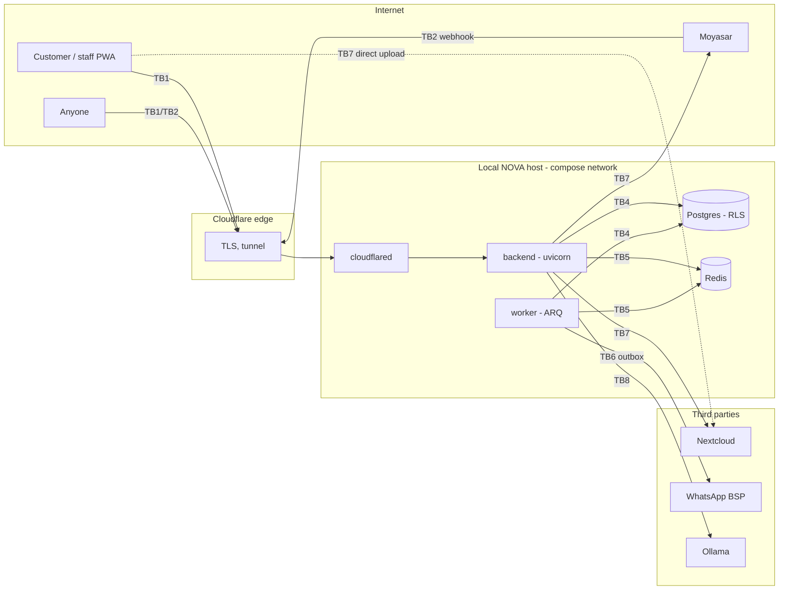

# Threat Model

> [!important] Purpose
> How NOVA defends itself, boundary by boundary: who can reach what, what stops them, and where
> that stops short. It ends in a findings register (§6) and in security requirements (§8) written so
> that each one can become a test. Use it before adding a public route, a new RLS window, an
> integration, an agent tool or a secret. Section 10 says when to update it.

> [!warning] Status, 2026-09-15
> Written against commit `51cf141`, plus the restored expired-key cleanup in
> `app/core/idempotency.py`. Findings TM-01 to TM-05 are **open**. Their descriptions explain the
> mechanism, enough to fix it. The repository is public, so decide when this document is published
> relative to those fixes.

Method: STRIDE per trust boundary. Every finding is marked with how it was established:
- **live**: reproduced against the local stack, test data removed afterwards;
- **code**: read in the source, with a file reference;
- **design**: follows from how the parts are meant to fit together.

It builds on the 2026-09-15 API security audit (SEC-01 to SEC-13, all fixed and retested live on
that date). Section 4 lists what those fixes established, so that it is not argued again.

---

## 1. System overview

| | |
| :--- | :--- |
| **Shape** | FastAPI modular monolith with an ARQ worker. One host, Docker Compose (docs/01, [[12-Backend-Code-Walkthrough]]). |
| **Ingress** | Cloudflare Tunnel (`cloudflared` dials out). Published ports bind to `127.0.0.1` only. |
| **State** | PostgreSQL 16 with forced row-level security. Redis 7 holds rate limits, login-failure counts, AI conversation memory and the ARQ queue. |
| **Integrations** | Moyasar (payments and webhook), a WhatsApp BSP (Meta Cloud API shape), Nextcloud (media over WebDAV), Ollama (local LLM, optional). |
| **Clients** | The SvelteKit PWA (not in this repository), and Moyasar calling the webhook. |

### Data classification

| Class | What | Where |
| :--- | :--- | :--- |
| **Restricted** | `SECRET_KEY`, which signs access tokens, slot ids, QR tickets and upload authorisations. Password hashes. Postgres, Redis, Moyasar, Nextcloud, WhatsApp and tunnel credentials. | `infra/.env`, `users.password_hash` |
| **Confidential (PDPL)** | Customer name, phone, email, booking `notes`, consent flags, AI chat text (redacted), notification payloads | `customers`, `bookings`, `notifications`, Redis `ai:conversation:*` |
| **Confidential (commercial)** | Payments, refunds, commission lines, invoices, payouts, subscription terms, analytics | `payments`, `commission_lines`, `invoices`, `payouts`, `subscriptions` |
| **Internal** | Unlisted or inactive catalog rows, staff schedules, memberships | `businesses`, `provider_schedules`, `memberships` |
| **Public** | Published storefronts: listed businesses, active locations, services, qualified providers, free slots | discovery routes (ADR-0010) |

### Principals

| Principal | How it is established | Reach |
| :--- | :--- | :--- |
| Anonymous | none | `/auth/register`, `/auth/login`, `/auth/refresh`, `/discovery/*`, `/webhooks/moyasar`, `/health*` |
| Customer | HS256 access token, `kind=customer` (no memberships) | **Every tenant** by design (`Principal.can_access_tenant`), then per-row ownership checks |
| Staff | `kind=staff` from active `memberships` at issue. Role read per tenant from `memberships` (`RequirePermission`). | Tenants in the token's `tenants` claim |
| Service | `kind=service`. Never issued by the app. Only the dev bypass constructs one directly. | Every tenant, every permission, no revocation check (see TM-03) |
| Gateway | HMAC signature or shared `secret_token` on the webhook, then a re-fetch from Moyasar | Payment status changes |
| Worker | Process identity; `nova_app` in the database | Cross-tenant through `bypass_tenant_scope`, then one tenant at a time |

---

## 2. Architecture and trust boundaries



| # | Boundary | Crossed by | Authenticates with | Enforced in | Kept honest by |
| :--- | :--- | :--- | :--- | :--- | :--- |
| TB1 | Internet → API | every request | TLS at Cloudflare; tunnel | compose loopback ports; `client_ip_key` | live checks (SEC-02) |
| TB2 | Anonymous → public routes | sign-up, login, discovery, webhook | nothing; the webhook signature; IP rate limits | `throttling.py`, `auth_service.py`, `payment/router.py` | `tests/test_route_guards.py` (`PUBLIC_ROUTES`) |
| TB3 | Principal → tenant | every `/tenants/{tenant_id}` route | bearer token + per-request `token_version` | `require_tenant_access`, `require_staff`, `RequirePermission`, per-row `*_for_principal` | `tests/test_route_guards.py`, `tests/test_role_permissions.py` |
| TB4 | Process → Postgres | API, worker | `nova_app` (NOSUPERUSER, NOBYPASSRLS) | forced RLS; `SET LOCAL` scope; three windows (§5.4) | `tests/test_row_level_security.py`, `enforce_rls_role` |
| TB5 | Process → Redis | API, worker | `REDIS_PASSWORD` | none beyond the password | — |
| TB6 | Outbox → handlers | worker | process identity | `worker/outbox.py`, `handlers.py` dedupe keys | `tests/test_payment_and_outbox.py` |
| TB7 | NOVA ↔ third parties | payments, media, messages | API keys, basic auth; the webhook signature | `integrations/*` | adapter tests |
| TB8 | User text ↔ model ↔ tools | AI chat | the caller's principal, carried into each tool | per-agent tool allowlist, per-row guards, usage limits, grounding validator | `tests/modules/ai_agents/` |
| TB9 | Source → build → deploy | commits, CI, images, env files | GitHub account; file permissions | `Makefile` secret generation; `.gitignore` | CI (no security gates yet) |

---

## 3. Assets and what an attacker wants

| Asset | Who benefits from breaking it | Worst credible outcome |
| :--- | :--- | :--- |
| Customer booking history and notes | stalkers, abusive partners, competitors | Private appointments (health and beauty treatments) read by someone who knows a phone number |
| A salon's customer list | competitors | Poaching, WhatsApp spam under the salon's name |
| Tenant isolation | any tenant, any customer | One salon reads or changes another's data |
| Money flows | fraudsters, dishonest staff | Deposits taken by a fake storefront; refunds by the wrong role; commission disputes |
| `SECRET_KEY` | anyone | Platform-wide admin tokens that cannot be revoked |
| Availability (booking calendar, GPU) | competitors, vandals | Calendars blocked by holds; login lockouts; inference starved |
| Business media | competitors | A salon's library read, replaced or deleted |

---

## 4. What already holds (verified 2026-09-15)

Established by SEC-01 to SEC-13 and retested live on the dev stack:

- **Authentication fails closed.**
  - `alg` is pinned to HS256, and malformed headers and claims get 401, not 500 (SEC-10).
  - Every staff and customer request re-reads `token_version` and `is_active`, so logout-everywhere and membership revocation take effect immediately (SEC-11).
  - A `kind=service` bearer token is refused outside local/test, and every token's `exp - iat` is capped at the refresh TTL — partial TM-03, 2026-09-15.
- **Tenant isolation has three layers.** Path-only `tenant_id` with authorization, `TenantScopedRepository`, and forced RLS on 24 tables for `nova_app`.
  - The live policy map shows `tenant_isolation` on every tenant table.
  - `public_discovery` is a `SELECT` policy on five catalog tables, and only rows that are published match.
  - `nova_app` holds DML only.
- **Routes are guarded mechanically.** Every non-public route authenticates, every tenant route authorizes, every authenticated write is rate-limited, and money routes demand a role permission (`tests/test_route_guards.py`).
- **Payments:**
  - a customer cannot set the amount or currency;
  - `return_url` must be on `PUBLIC_APP_URL`'s origin, and look-alike hosts and userinfo tricks are refused;
  - webhooks are verified, stored without `secret_token`, and a status change is applied only when Moyasar's own record confirms it (SEC-03, SEC-07).
- **Login:** at most 5 failures per account per client in 15 minutes, a lock after 20 failures from anywhere, and the same 429 for real and unknown addresses. `X-Forwarded-For`, `CF-Connecting-IP` and `X-Real-IP` are not trusted unless configured (SEC-04, in the dev image).
- **Holds and idempotency:** a customer may hold 3 live slots per tenant. Idempotency keys are scoped to endpoint, tenant and principal, and are checked after authorization (SEC-05, SEC-08).
- **AI:** no agent can cancel, and text that tries to close the untrusted-text frame is defused (SEC-09).
- **Infrastructure:**
  - loopback ports, Redis authentication, and ARQ jobs as JSON rather than pickle;
  - `backend` and `worker` get no schema-owner credentials;
  - docs are off in production, and production refuses a weak key and dev bypass (SEC-01, SEC-02, SEC-13).

---

## 5. STRIDE per boundary

S spoofing · T tampering · R repudiation · I information disclosure · D denial of service ·
E elevation of privilege. "Ref" points at §6 (TM-xx) or §8 (SR-xx).

### 5.1 TB1: Internet → API

| | Threat | Current control | Residual | Ref |
| :-- | :--- | :--- | :--- | :--- |
| S | Client address forged to get a fresh rate-limit bucket per request | The dev image trusts only `CF-Connecting-IP` (with a tunnel token) or the TCP peer | **The production image trusts `X-Forwarded-For` from any peer** | TM-02 |
| E | A compromised backend reads the tunnel token and runs a rogue connector, receiving a share of live traffic | none; `env_file` hands the token to `backend` and `worker` | open | TM-07 |
| D | Oversized request bodies | Cloudflare's plan limit only; no app-level cap | open | TM-10 |
| I | API schema published | docs off outside local/test (SEC-13) | closed | — |
| I/T | Missing hardening headers; unvalidated inbound `X-Correlation-ID` written to logs | none | low | TM-19 |

### 5.2 TB2: Anonymous → public routes

| | Threat | Current control | Residual | Ref |
| :-- | :--- | :--- | :--- | :--- |
| S | Registering with someone else's **phone number**, then being matched to their customer record | none; the phone is never verified | **open, high** | TM-01 |
| S | Registering someone else's **email** before they are added as staff | none; no email verification | **open, high** | TM-04 |
| S | Forged payment webhook | HMAC or shared secret, then a re-fetch from Moyasar (SEC-07) | closed | — |
| I | Registration answers 409 for a known email | none | known, tracked in the audit | — |
| I | Public availability as an occupancy oracle | 20 requests a minute per IP; 14-day window | accepted (ADR-0010), weakened by TM-02 | TM-02 |
| D | Credential stuffing; locking a victim out with 20 failures | per-IP and per-account-per-client limits; the lock | weakened by TM-02 | TM-02 |
| D | Unauthenticated webhook reads the whole body; no rate limit | signature check after the read | open | TM-10 |
| R | Referral clicks recorded by NOVA's own client decide 35% commission | hashed token row with a timestamp and the booking that claimed it (ADR-0010) | a salon can dispute but cannot verify a click | TM-12 |

### 5.3 TB3: Principal → tenant

| | Threat | Current control | Residual | Ref |
| :-- | :--- | :--- | :--- | :--- |
| E | Customer reads or takes over another customer's bookings through a phone match | none | **open, high** | TM-01 |
| E | A token signed with `SECRET_KEY` and `kind=service` is admin on every tenant, never revoked, with whatever expiry its minter chose | a strong key and a public repository with rotated history | **open, high** | TM-03 |
| E | Pre-registered account granted staff by email | none | **open, high** | TM-04 |
| I | A customer reads any tenant's phone (`GET /tenants/{id}`), unlisted or inactive catalog rows, and provider working hours | tenant ids of listed salons are public; others are UUIDv4 | low | TM-15 |
| S | Stolen refresh token used for 30 days | logout-everywhere only; no rotation or reuse detection | open | TM-09 |
| R | A staff member denies a refund, role change, consent change or cancellation | app logs and domain events; no audit record naming the actor | open | TM-12 |
| T | A fake storefront impersonates a real salon and takes deposits | none: any account can create tenants, and new businesses are listed by default | open | TM-11 |
| E | Staff role matrix (owner, manager, receptionist, provider) | one table in `identity/domain.py`, enforced per tenant | the matrix was a default, never confirmed by the product owner | — |

### 5.4 TB4: Process → Postgres

| | Threat | Current control | Residual | Ref |
| :-- | :--- | :--- | :--- | :--- |
| E | App connected as an RLS-exempt role | `nova_app`; `enforce_rls_role` refuses it in staging and production | closed | — |
| E | RLS windows left open | `bypass_tenant_scope` in the webhook, login token issue, outbox and cron jobs; `set_tenant_scope` turns it off | maintenance jobs write under the bypass; handlers for events with no tenant run with it on | TM-16 |
| I | Tables with no RLS: `users` (password hashes), `tenants`, `domain_events` (cross-tenant payloads), `idempotency_keys` (stored responses), `webhook_events` | bound parameters throughout; no string-built SQL | a single injection or ORM slip reads across tenants | SR-15 |
| T | Double booking | advisory lock | the exclusion constraint matches 0 rows, because enums are stored as uppercase names (2026-09-15 DB review) | tracked in the DB review |
| D | Runaway query | `statement_timeout` of 10 s; pool limits | closed | — |
| D | Data loss | none: no backup job, no restore test (docs/09 #20) | open | TM-14 |

### 5.5 TB5: Process → Redis

| | Threat | Current control | Residual | Ref |
| :-- | :--- | :--- | :--- | :--- |
| T | Forged AI history: tool-return parts from earlier turns count as **grounded**, so an owner agent can be made to quote invented figures | `REDIS_PASSWORD`, loopback | open | TM-08 |
| T | Login-failure and rate-limit counters reset | `REDIS_PASSWORD` | open (same root as TM-08) | TM-08 |
| E | Code run through the job queue | JSON codec, no pickle; every job is an idempotent cron with no arguments | closed | — |
| I | Owner revenue figures and redacted customer text persisted in the AOF, unencrypted, for 24 h | TTL, turn cap | accepted locally; requirement for production | SR-12 |
| D | Redis down | limiter degrades to in-process buckets; history starts empty | per-process limits multiply by process count | SR-11 |

### 5.6 TB6: Outbox → handlers

| | Threat | Current control | Residual | Ref |
| :-- | :--- | :--- | :--- | :--- |
| T | Event delivered twice (at-least-once) | dedupe keys; `accrue_for_booking` idempotency; unique indexes | closed | — |
| E | Handler runs cross-tenant | `set_tenant_scope(tenant_id)` before handlers | **not when `tenant_id` is None**: the bypass stays on for that event's handlers | TM-16 |
| D | Poison event blocks the queue | per-event transaction, retry schedule, dead-letter log | closed | — |
| R | Commission accrued or reversed without a trace | `CommissionAccrued` / `CommissionReversed` events; lines are immutable with offsetting reversals | closed | — |

### 5.7 TB7: NOVA ↔ third parties

| | Threat | Current control | Residual | Ref |
| :-- | :--- | :--- | :--- | :--- |
| E | **Browser uploads to Nextcloud need Nextcloud credentials.** `upload_url` is the service account's WebDAV path. NOVA's `upload_token` is checked only by NOVA, at `complete`, and Nextcloud never sees it. | none | **open, high (design)**. The only way to make the flow work as written is to give browsers the service account, which can read, write and delete every tenant's media. | TM-05 |
| I | Public share links permanent: `expires_days` is never sent, each call creates a new share, deleting an asset revokes nothing, and nothing ever calls `purge_deleted` | staff-only route with a write rate limit | open | TM-06 |
| T | One Nextcloud account for all tenants; the path prefix is the only isolation | `assert_path_belongs_to_tenant` in NOVA | one credential exposes every tenant | TM-05 |
| T | Uploaded bytes not what was declared (HTML as `image/png`); PDFs accepted | content type from an allowlist, as the client declared it | low; depends on Nextcloud's serving headers | TM-18 |
| S/T | Messages sent under a salon's WhatsApp number to any phone a staff member typed, with consent the staff member asserted | per-principal write limit; consent flags | low | TM-17 |
| S | Future WhatsApp delivery-receipt webhook | not implemented (`mark_delivery_status` has no route) | requirement before it ships | SR-21 |
| T | Moyasar webhook replay | event id dedupe; status taken from Moyasar's record | closed | — |

### 5.8 TB8: User text ↔ model ↔ tools

| | Threat | Current control | Residual | Ref |
| :-- | :--- | :--- | :--- | :--- |
| E | Prompt injection makes a tool act beyond the caller | per-agent allowlist; each tool runs the route's own per-row guard; no cancel; holds capped; usage limits (8 requests, 12 tool calls) | the injection heuristic flags "refund" (known); the escalation summary is dropped (known) | — |
| E | `list_my_bookings` / `join_queue` commit a phone-match takeover inside their unit of work | none | open | TM-01 |
| T | Invented figures in owner answers | output validator against grounded values | grounded values include history, which Redis can forge | TM-08 |
| S/T | Model swapped or poisoned; Ollama's API has no authentication | Ollama is not running on this host today | requirement | TM-20 |
| D | GPU starved by many free accounts chatting | 40 writes a minute per principal; 30 s turn timeout | no per-tenant inference concurrency cap | TM-20 |

### 5.9 TB9: Source → build → deploy

| | Threat | Current control | Residual | Ref |
| :-- | :--- | :--- | :--- | :--- |
| I | Secrets in a public repository | `.env.example` holds no values; `make infra/.env` generates them; history holds rotated secrets (SEC-01) | no secret scanning | TM-13 |
| T | Vulnerable or compromised dependency | `uv.lock`, `UV_FROZEN=1` | no SCA, SAST or SBOM; actions pinned by tag; no `permissions:` block | TM-13 |
| T | Base image drift | none: `python:3.13-slim`, `postgres:16`, `redis:7-alpine` and `cloudflare/cloudflared:latest` are tags, not digests | open | TM-13 |
| R | Red CI becomes normal | — | `alembic check` fails on known drift, so the migrations job is red | tracked in the DB review |
| I | Debug logging in production | — | `Settings.debug` defaults to `True` | TM-19 |

---

## 6. Findings register

Severity follows the scale in the AppSec review: Critical is remote code execution, an
authentication bypass or injection with data access; High is IDOR with sensitive data, or
privilege escalation. Evidence is `live`, `code` or `design` (see the top of this document).

| ID | Sev | Finding | Evidence |
| :--- | :--- | :--- | :--- |
| TM-01 | **High** | An unverified phone number claims another person's customer record, at every tenant | live |
| TM-02 | **High** | The production image makes `X-Forwarded-For` the client address, so every per-IP limit can be bypassed | live (uvicorn 0.52.3) |
| TM-03 | **High** — partially fixed 2026-09-15 | `SECRET_KEY` mints non-revocable, platform-wide service tokens, and the same key signs everything | code |
| TM-04 | **High** | No email verification, and memberships are granted by email: a pre-registered account becomes staff | code |
| TM-05 | **High** | The media upload authorisation cannot be enforced by Nextcloud, and one service account holds every tenant's media | code, design |
| TM-06 | Medium | Share links never expire, survive deletion, and binaries are never purged | code |
| TM-07 | Medium | The tunnel token is given to `backend` and `worker` | code |
| TM-08 | Medium | Redis write access forges AI grounding and resets login limits | code |
| TM-09 | Medium | 30-day refresh tokens with no rotation or reuse detection | code |
| TM-10 | Medium | No request body cap; the unauthenticated webhook reads the whole body and has no rate limit | code |
| TM-11 | Medium | Marketplace onboarding without verification: fake storefronts, listed by default | design |
| TM-12 | Medium | No actor-attributed audit record for privileged staff actions or commission disputes | code |
| TM-13 | Medium | No secret scanning, SCA or SAST; images and actions not pinned | code |
| TM-14 | Medium | No database backup or tested restore (docs/09 #20) | code |
| TM-15 | Low | Customer-readable tenant data: tenant phone, unlisted and inactive catalog rows, provider schedules | code |
| TM-16 | Low | Maintenance jobs write under the RLS bypass; handlers for tenant-less events run bypassed | code |
| TM-17 | Low | A salon's WhatsApp number can message any phone staff enter, on staff-asserted consent | code |
| TM-18 | Low | Uploaded bytes are not checked against the declared type | code |
| TM-19 | Low | No hardening headers; `debug` defaults to true; correlation ids unvalidated | code |
| TM-20 | Info | Ollama unauthenticated, models pinned by tag, no inference concurrency cap per tenant | design |

### TM-01: An unverified phone number claims another person's customer record

- **Where:**
  - `identity/service.py:268` `ensure_for_user` matches by `user.phone` and sets `by_phone.user_id = user.id`.
  - `identity/repository.py:193` `get_by_phone` does not filter records that already have a `user_id`.
  - `users.phone` is whatever the person typed at `/auth/register`.
- **Reached from:**
  - `BookingService.list_for_customer_reference`, i.e. `GET /tenants/{id}/bookings` and the AI `list_my_bookings` tool;
  - `BookingService.create`;
  - `QueueService.join`, over HTTP and through the AI `join_queue` tool.
- **Verified live:**
  - An account registered with a seed customer's phone number received that customer's booking, `notes` field included, from `GET /tenants/{id}/bookings`.
  - The victim's record was already linked to a different account.
  - The GET does not commit, so the read left no trace and can be repeated at every tenant.
  - A committing path (booking, queue join, or an AI turn) makes the takeover permanent. The victim's own account is unlinked from their history.
- **Impact:** booking history and notes, cancelling or rescheduling another person's appointments, and payments on their bookings. Customer phone numbers in the GCC are effectively public.
- **Fix:**
  - Read paths never provision or claim a record.
  - A phone number links an existing record only after it has been verified (a one-time code over WhatsApp), and only if the record is unclaimed.
  - A `user_id`, once set, is never overwritten.

```python
# identity/service.py: a sketch. `phone_verified_at` needs a migration and an OTP flow.
async def ensure_for_user(self, user: User) -> Customer:
    existing = await self.repository.get_by_user_id(user.id)
    if existing is not None:
        return existing
    if user.phone and user.phone_verified_at is not None:
        walk_in = await self.repository.get_unclaimed_by_phone(user.phone)  # user_id IS NULL
        if walk_in is not None:
            walk_in.user_id = user.id
            await self.repository.session.flush()
            return walk_in
    if not user.phone:
        raise CustomerPhoneRequiredError()
    return await self.create(full_name=user.full_name, phone=user.phone, email=user.email, user_id=user.id)

# booking/service.py: listing reads, never provisions.
async def list_for_customer_reference(self, reference_id, *, self_service, limit=20, offset=0):
    if self_service:
        customer = await self.customers.find_for_user(reference_id)
        if customer is None:
            return []
    else:
        customer = await self.customers.get(reference_id)
    return await self.repository.list_for_customer(customer_id=customer.id, limit=limit, offset=offset)
```

A second customer record with the same phone number must then be allowed at a tenant, or refused
clearly. Check the uniqueness rules on `customers.phone` before changing this.

### TM-02: The production image makes `X-Forwarded-For` the client address

- **Where:** `nova_backend/Dockerfile` runtime `CMD` passes `--proxy-headers --forwarded-allow-ips "*"`.
- **What happens:** uvicorn's `ProxyHeadersMiddleware` then replaces `scope["client"]` with the first `X-Forwarded-For` entry from any peer. `client_ip_key` falls back to `request.client.host` when no trusted header is configured, or when the configured header is absent from the request.
- **Verified:** with uvicorn 0.52.3 and the real `client_ip_key`, three requests from one peer carrying three forged `X-Forwarded-For` values produced three distinct rate-limit keys. With uvicorn's default trust (`127.0.0.1`) they all got the peer's key.
- **Impact:** unlimited credential stuffing across accounts. A victim can be locked out repeatedly (20 failures). Registration and discovery limits, including the occupancy oracle, stop limiting. The dev image does not pass these flags, which is why SEC-04 held in the retest.
- **Fix:** `client_ip_key` already reads the header the proxy writes, so drop the flags. Alternatively, trust only the `cloudflared` container's address. Refuse to start a deployed process with no trusted client-IP source.

```dockerfile
CMD ["uvicorn", "app.main:app", "--host", "0.0.0.0", "--port", "8000"]
```

```python
# config.py, in _refuse_unsafe_configuration
if self.env not in DEVELOPMENT_ENVS and self.trusted_client_ip_header is None:
    raise ValueError("Set CLIENT_IP_HEADER (or CLOUDFLARE_TUNNEL_TOKEN): rate limits need the real client address.")
```

### TM-03: `SECRET_KEY` is a platform-wide, non-revocable master credential

- **Where:**
  - `security.py:329` accepts any `kind` claim.
  - `can_access_tenant` returns True for `SERVICE`.
  - `get_principal` skips the `token_version` check for `SERVICE`.
  - `MembershipService.require_permission` passes `SERVICE` on every permission.
  - `exp` has no upper bound.
  - The app never issues a service token: `_issue_pair` mints staff or customer only.
- **One key for everything:** the same key signs access and refresh tokens, slot ids, QR tickets and upload authorisations, with no per-purpose separation and no key id for rotation.
- **Impact:** whoever holds the key, now or from any past leak, reaches every tenant with every permission until the key changes. Rotating it invalidates every token, ticket and slot at once.
- **Fix:**
  - Refuse `kind=service` over HTTP outside local and test; the dev bypass builds its principal without a token.
  - Cap `exp - iat` at the refresh TTL.
  - Derive a key per purpose from the root key, and add a `kid` for rotation.

```python
# security.py, in get_principal, after decode_token
if claims.get("kind") == PrincipalKind.SERVICE and get_settings().env not in DEVELOPMENT_ENVS:
    raise AuthenticationError("Service principals do not authenticate over HTTP.")
if not isinstance(claims.get("iat"), int) or claims["exp"] - claims["iat"] > REFRESH_TOKEN_TTL_SECONDS:
    raise AuthenticationError("Token lifetime is invalid.")

def purpose_key(secret: str, purpose: str) -> bytes:
    return hmac.new(secret.encode(), f"nova:{purpose}".encode(), sha256).digest()
```

- **Fixed, 2026-09-15 (partial):**
  - `get_principal` now refuses a bearer token naming `kind=service` outside local/test
    (`_service_kind_refusal`), the same environments the dev bypass itself is honoured in. A
    leaked key can no longer mint unrevocable, platform-wide access over HTTP in a deployed
    environment — the app never puts that claim on a token itself, so a live request bearing one
    proves only key possession, nothing else.
  - `decode_token` now requires an `iat` claim and refuses `exp - iat > REFRESH_TOKEN_TTL_SECONDS`
    (30 days), for every token — access, refresh, and any forged one. A leaked key can no longer
    mint a token that outlives the longest one this app ever issues itself.
  - **Still open:** one root key signs access tokens, refresh tokens, slot ids, QR tickets and
    upload authorisations, with no per-purpose derivation and no `kid` for rotation. A leaked key
    still forges a valid, bounded-lifetime STAFF or CUSTOMER token for any account whose current
    `token_version` the forger also knows — the fixes above close the SERVICE-principal and
    unbounded-lifetime angles specifically, not the key-compromise scenario as a whole.
  - Tests: `tests/test_security.py::TestServiceKindRefusal`, the lifetime-bound cases in
    `TestTokenVerification`, and `test_a_service_token_is_refused_outside_local_and_test`.

### TM-04: A pre-registered account becomes staff

- **Where:**
  - `AuthService.register` stores any email unverified.
  - `MembershipService.grant` (`identity/service.py:344`) resolves the grantee with `users.find_by_email` and grants the role to whoever registered that address first.
- **Impact:** someone who anticipates a salon's staff address (they are often public, e.g. `reception@salon…`) registers it, and the owner's grant hands them the customer list, the calendar and, as manager, refunds and financials.
- **Fix:** verify an email before it can receive a membership, or replace grant-by-email with an invite token delivered to that mailbox and accepted from it.

```python
# identity/service.py, in grant
user = await self.users.find_by_email(validate_email(email))
if user is None or user.email_verified_at is None:
    raise UserNotFoundError(email)  # the same answer, so grants are not an enumeration oracle
```

### TM-05: Media upload authorisation cannot be enforced by storage

- **Where:**
  - `NextcloudStorage.upload_url_for` returns `{NEXTCLOUD_URL}/remote.php/dav/files/{service user}/…`.
  - `sign_upload_authorisation` produces a token only `complete_upload` checks.
  - Every tenant's files live under one Nextcloud account (`nextcloud_username`).
- **Impact:** the upload flow in docs/02 §4 cannot work from a browser as written. Implementing it by giving the PWA working WebDAV credentials would let any staff member of any salon read, overwrite or delete every tenant's media, and create public shares.
- **Fix:**
  - For each upload, create a short-lived, **create-only** share on the asset's folder (`shareType=3`, `permissions=4`, with a password and `expireDate`), and return that URL instead of the WebDAV path. Delete the share in `complete_upload`.
  - Longer term, give each tenant its own Nextcloud user or group folder, so the path prefix is not the only isolation.

### TM-06 to TM-20

| ID | Where | Fix |
| :--- | :--- | :--- |
| TM-06 | `nextcloud.py:150` never sends `expireDate`; `media/service.py:270` soft-delete leaves shares; `purge_deleted` has no caller | Send `expireDate`; store share ids and revoke them on delete; add a cron job that purges soft-deleted binaries |
| TM-07 | `infra/docker-compose.yml`: `env_file: .env` on every backend-image service; only `POSTGRES_PASSWORD` is blanked | Blank `CLOUDFLARE_TUNNEL_TOKEN` in `x-backend-environment`; tell the app with a non-secret `CLIENT_IP_HEADER=CF-Connecting-IP` instead |
| TM-08 | `runtime.py:249` adds tool returns from history to `grounded_values`; `rate_limit.py` keeps counters in Redis | Ground only this turn's tool calls, or HMAC each stored turn with a purpose key and drop turns that fail; keep Redis off every network but the compose one |
| TM-09 | `security.py:105` 30-day refresh; `AuthService.refresh` re-issues without rotating | Store a refresh `jti` family; rotate on every use; a reused `jti` revokes the family |
| TM-10 | `payment/router.py:202` `await request.body()` before verification; no body cap anywhere | A pure ASGI middleware refusing `Content-Length` over 1 MB (64 KB on `/webhooks/*`) and counting streamed bytes; an IP rate limit on the webhook |
| TM-11 | `POST /tenants` open to any account; `is_listed` defaults to true | List a business only after verification (commercial registration, phone); hold payouts until the payout destination is verified |
| TM-12 | refunds, role changes, grants, consent updates, staff cancellations and plan changes leave only logs | An append-only `audit_events` table with actor, tenant, action, target, before and after, written in the same transaction; no UPDATE or DELETE grant to `nova_app` |
| TM-13 | `.github/workflows/ci.yml`; image tags in `Dockerfile` and compose | pip-audit or osv-scanner on `uv.lock`; gitleaks over full history; Semgrep rules for NOVA invariants; `permissions: contents: read`; actions and images pinned by digest; Dependabot |
| TM-14 | compose has volumes and no backup | A nightly encrypted `pg_dump` off-host, with a restore rehearsal that runs the test suite against the restored copy |
| TM-15 | `identity/router.py:78` `get_tenant` returns `phone`; catalog `get_*` / `list_*` do not filter unlisted or inactive rows; `booking/router.py:198` provider schedule | `require_staff` on tenant detail, catalog management reads and schedules; customers use discovery's projection |
| TM-16 | `arq_worker.py` ticket expiry, hold, key and media sweeps write under the bypass; `outbox.py:92` runs handlers bypassed when `tenant_id` is None | Read candidates bypassed, then write per tenant (the CLAUDE.md pattern); switch the bypass off before running handlers for a tenant-less event |
| TM-17 | `POST /customers` takes staff-asserted `whatsapp_consent`; template params include `full_name` | Confirm consent with the customer (double opt-in over WhatsApp) before the first non-transactional send; limit sends per tenant per hour |
| TM-18 | `media/domain.py` validates the declared type only | On completion, `stat` the object and compare size and type; sniff the first bytes; serve PDFs as attachments with `nosniff` |
| TM-19 | no `nosniff` or `no-store` headers; `config.py:22` `debug: bool = True`; `middleware.py:27` takes any `X-Correlation-ID` | Add headers in middleware; default `debug` to False; accept only `[A-Za-z0-9-]{1,64}` correlation ids |
| TM-20 | `ollama_base_url`; models `llama3.1:8b` and `llama3.1:70b` by tag | Ollama on loopback or the compose network only; pin model digests; a per-tenant semaphore on inference |

---

## 7. Attack paths worth rehearsing

A tabletop exercise per release, and a test where noted.

1. **Customer to someone else's appointments (TM-01).** Register, set a phone number, list bookings at a salon, then book. *Expect after the fix:* an empty list, and a new customer record rather than a claimed one.
2. **Stuffing through the production image (TM-02).** Deploy the runtime image behind a proxy that forwards `X-Forwarded-For`, and send six failed logins with distinct forwarded addresses. *Expect:* the sixth answers 429.
3. **Leaked key to platform admin (TM-03).** Sign `kind=service` with the key, then call a refund route on an unrelated tenant. *Expect:* 401 in staging.
4. **Pre-registered staff (TM-04).** Register an address, then have an owner grant it. *Expect:* 404 until the address is verified.
5. **Compromised backend container (TM-05, TM-07, TM-08).** List what its environment holds (tunnel token, Nextcloud credentials, Redis password, `SECRET_KEY`) and what each reaches. *Expect after the fixes:* no tunnel token; per-purpose keys; Nextcloud scoped per tenant.

---

## 8. Security requirements

Each requirement names the test that proves it. "New" means that test does not exist yet.

| ID | Requirement | Verified by |
| :--- | :--- | :--- |
| SR-01 | A phone number links an existing customer record only after the number is verified, and only if the record has no `user_id`. A `user_id` is never overwritten. | New: `tests/modules/identity/test_customer_claims.py` (register with a known number, list and book; the original record is untouched) |
| SR-02 | Read endpoints and read-only agent tools never create or modify rows. | New: a test that snapshots row counts around every GET route in the registry |
| SR-03 | A deployed process derives the client address only from a configured, proxy-written header, and refuses to start without one. The runtime image does not pass `--forwarded-allow-ips "*"`. | New: a `tests/test_throttling.py` case wrapping `client_ip_key` in `ProxyHeadersMiddleware` with the image's flags; a settings refusal test |
| SR-04 | Tokens with `kind=service` are refused over HTTP outside local and test; tokens whose `exp - iat` exceeds the refresh TTL are refused. | New cases in `tests/test_security.py` |
| SR-05 | Tokens, slot ids, QR tickets and upload authorisations use distinct keys derived from `SECRET_KEY`, and tokens carry a `kid` so a rotation can overlap. | New: `tests/test_security.py` (a slot-id MAC does not verify as a ticket MAC) |
| SR-06 | A membership can be granted only to a verified email address or through an accepted invite. | New: `tests/modules/identity/test_memberships.py` |
| SR-07 | Upload authorisation is enforced by the storage server, and no client ever receives storage credentials. | New: `tests/modules/media/test_service.py` asserts the upload URL is a share URL with an expiry |
| SR-08 | Every public share has an expiry; deleting an asset revokes its shares; soft-deleted binaries are purged within 7 days. | New: adapter test for `expireDate`; worker test for the purge job |
| SR-09 | `backend` and `worker` receive no tunnel token. | New: a CI step running `docker compose config` and asserting `CLOUDFLARE_TUNNEL_TOKEN` is empty for both |
| SR-10 | Refresh tokens rotate on use, and a reused refresh token revokes its family. | New: `tests/modules/identity/test_refresh_rotation.py` |
| SR-11 | Request bodies are capped before parsing (1 MB, 64 KB for webhooks); the webhook is IP rate-limited; per-process fallback limits are logged as degraded. | New: `tests/test_body_limits.py` |
| SR-12 | Only tool results that were produced or integrity-checked by this server count as grounded. Owner-agent history is not kept beyond 24 h. | New: `tests/modules/ai_agents/test_turns.py` (a forged history tool return does not ground a figure) |
| SR-13 | Refunds, role changes, grants and revocations, consent changes, staff cancellations and plan changes write an append-only audit record in the same transaction. | New: `tests/test_audit_trail.py`; `test_row_level_security.py` asserts `nova_app` lacks UPDATE and DELETE on it |
| SR-14 | A new business is not listed until verified, and no payout is settled to an unverified destination. | New: `tests/modules/discovery/` and `tests/modules/billing/` |
| SR-15 | Which tenant routes a customer principal can call is an explicit allowlist; tenant contact details, unlisted catalog rows and schedules require staff. | Extend `tests/test_route_guards.py` with `CUSTOMER_REACHABLE_ROUTES` |
| SR-16 | Maintenance writes run per tenant, and the dispatcher never runs a handler with the bypass on. | New: `tests/test_worker_jobs.py` asserts `app.bypass_rls` is off inside handlers |
| SR-17 | CI fails on a known-vulnerable locked dependency, a committed secret, or a Semgrep rule for NOVA's invariants; workflows are least-privilege; actions and images are pinned by digest. | `.github/workflows/ci.yml` |
| SR-18 | A nightly encrypted database backup is restored and tested on a schedule. | Restore runbook plus a scheduled job (docs/09 #20) |
| SR-19 | Ollama is reachable only from the backend; models are pinned by digest; inference is capped per tenant. | Deployment checklist; a service test for the per-tenant semaphore |
| SR-20 | Responses carry `X-Content-Type-Options: nosniff`, and `Cache-Control: no-store` on auth and money routes; `debug` defaults to false; correlation ids are validated. | New: `tests/test_security_headers.py` |
| SR-21 | Any new inbound webhook verifies a signature over the raw body before parsing, and is rate-limited and deduplicated. | Route guard: a new public route fails `test_every_route_authenticates_unless_it_cannot` until listed with its control |
| SR-22 | A completed upload's stored size and type match what was declared, and PDFs are served as attachments. | New: `tests/modules/media/test_service.py` |

---

## 9. Assumptions and out of scope

- **The frontend is not in this repository.** XSS, CSP, token storage in the browser and clickjacking belong to the PWA's own threat model. Requirement for it: keep access tokens in memory, and send refresh tokens only over TLS.
- **Single host.** The compose network is treated as trusted. Moving Postgres, Redis or Ollama to another host needs TLS and authentication on each link, and a new version of §5.4 and §5.5.
- **Out of scope:** Cloudflare account security, the host operating system, physical access to the server, and the security of Moyasar, Meta and Nextcloud themselves.
- **Stale ADRs.** Their Consequences sections describe the code as it was when written; ADR-0006 lists rate limiting, idempotency and RLS as missing. Section 4 of this document is the current state.

---

## 10. Keeping this model true

Update this document, and the tests named in §8, whenever a change:

- adds a route outside `/tenants/{tenant_id}`, or a public prefix (TB2);
- adds a use of `bypass_tenant_scope`, `set_discovery_scope` or any other RLS window (TB4);
- adds a Redis key family, an ARQ job or an outbox handler (TB5, TB6);
- adds an integration, an inbound webhook or a new secret (TB7, TB9);
- adds an agent tool, or changes an agent's tool list (TB8);
- changes who a customer principal may reach (TB3).

Related: [[01-Architecture-System-Overview]], [[10-AI-Agent-Catalog]],
[[13-Business-Agents-and-Analytics]], `docs/decisions/0003-tenant-isolation-strategy.md`,
`docs/decisions/0006-api-security-and-reliability-baseline.md`,
`docs/decisions/0010-public-discovery-and-marketplace-attribution.md`,
`docs/decisions/0011-business-agents-and-analytics.md`.
